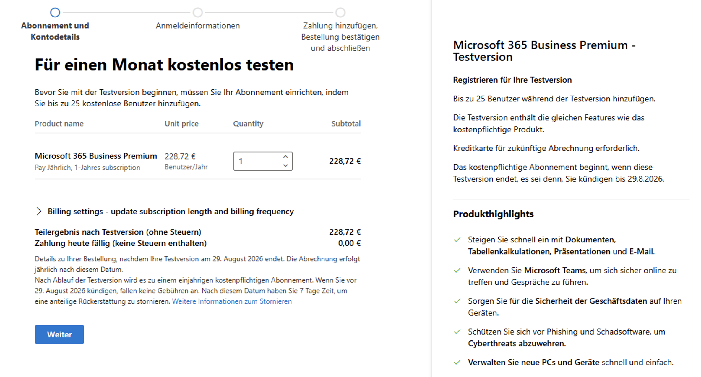
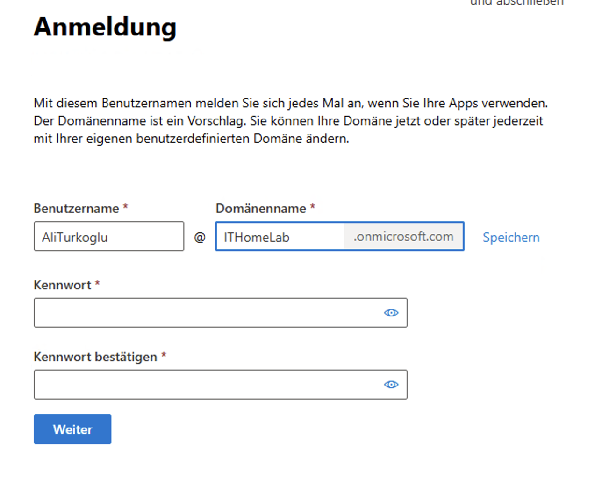
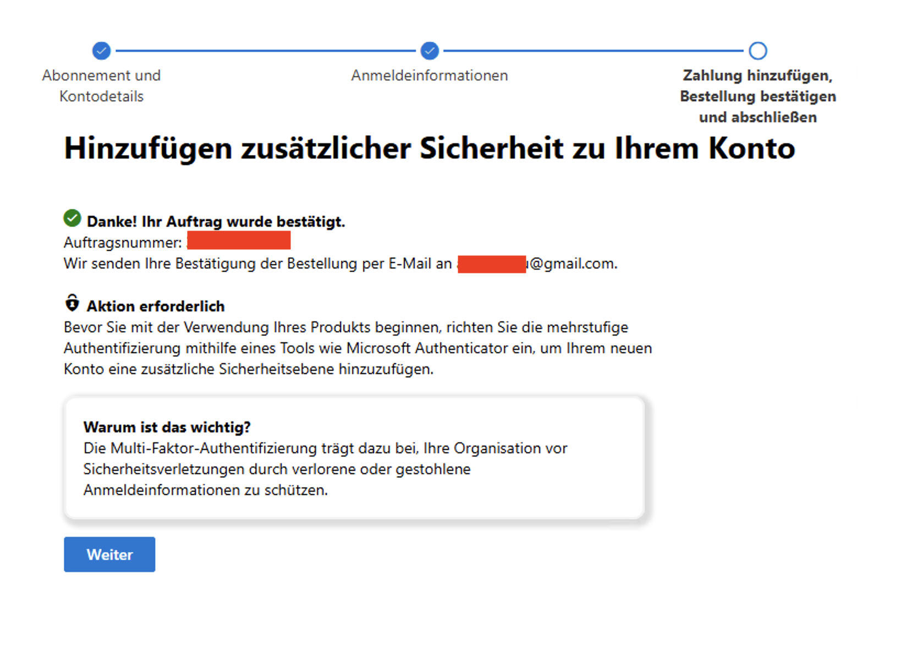
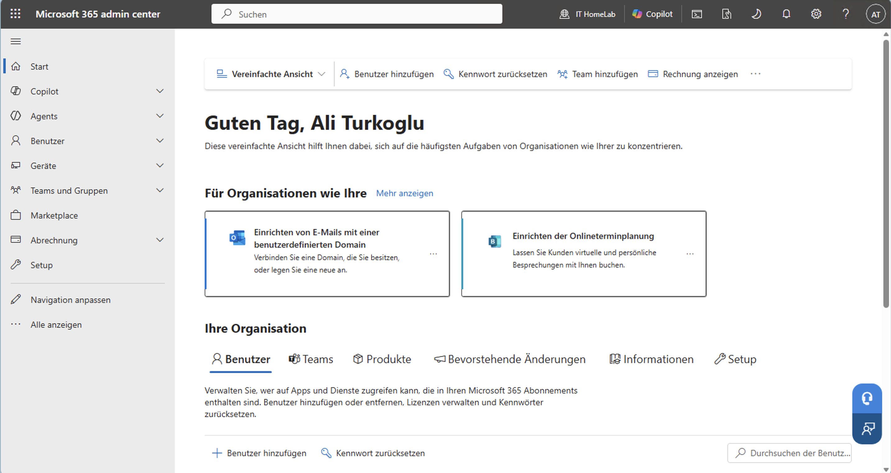

# Phase 13 – Cloud Environment Preparation

> **Status:** ✅ Completed

---

## Overview

This phase prepares the HomeLab for Microsoft cloud administration.

Before connecting the on-premises environment to Microsoft 365, I prepared the management workstation, created a Microsoft 365 Business Premium trial tenant, enabled Multi-Factor Authentication (MFA), and verified access to the Microsoft 365 Admin Center.

This environment will be used throughout the remaining phases of the Cloud & Identity project.

---

## Objectives

- Prepare the management workstation.
- Create a Microsoft 365 Business Premium trial tenant.
- Configure the Microsoft Entra ID tenant.
- Enable Multi-Factor Authentication (MFA).
- Verify access to the Microsoft 365 Admin Center.
- Prepare the environment for the next phases.

---

## Preparing the Lab

I normally use a MacBook as my daily computer. However, this project focuses on Windows administration, so I decided to use my Windows 11 virtual machine for all Microsoft 365 management tasks.

The Windows 11 VM was originally created with a 40 GB virtual disk. Before starting the cloud configuration, I increased the virtual disk size to 100 GB in Proxmox. Inside Windows, I extended the system partition using AOMEI Partition Assistant.

To avoid using the built-in **Domain Administrator** account for daily work, I created a separate user account in the **IT** organizational unit and added it to the **Local Administrators** group on the Windows 11 client.

---

## Microsoft 365 Environment Setup

A one-month Microsoft 365 Business Premium trial was selected for this HomeLab. It includes all the enterprise cloud services required for the following phases of this project.

A new Microsoft 365 tenant was created using the **ithomelab.onmicrosoft.com** domain. This tenant will be used throughout the Cloud & Identity project.

| Microsoft 365 Business Premium Trial | Tenant Configuration |
|:------------------------------------:|:--------------------:|
|  |  |

During the initial setup, Microsoft required Multi-Factor Authentication (MFA). MFA was enabled for the Global Administrator account before accessing the tenant to ensure maximum security from day one.

After the setup was completed, the Microsoft 365 Admin Center became available. This portal will be used to manage users, licenses, cloud services, and security settings.

| Multi-Factor Authentication Setup | Microsoft 365 Admin Center |
|:---------------------------------:|:--------------------------:|
|  |  |

---

## Configuration Summary

| Component | Configuration |
|-----------|---------------|
| Subscription | Microsoft 365 Business Premium Trial |
| Tenant | ithomelab.onmicrosoft.com |
| Identity | Microsoft Entra ID |
| Authentication | Multi-Factor Authentication (MFA) |
| Management Device | Windows 11 Client VM |

---

## Validation

The following items were verified after the deployment:

- ✅ Microsoft 365 tenant created successfully.
- ✅ Microsoft 365 Admin Center accessible.
- ✅ Business Premium trial license activated.
- ✅ Multi-Factor Authentication enabled.
- ✅ Microsoft Entra ID available and ready for configuration.

---

## Lessons Learned

- **Management Workstation:** Prepare the management workstation before starting the cloud deployment. Having a clean environment prevents browser cache or local policy issues.
- **Security Best Practices:** Use a dedicated administrator account instead of the built-in Domain Administrator for daily work to follow the Principle of Least Privilege.
- **MFA is Mandatory:** Enable Multi-Factor Authentication from the very beginning to protect the Global Administrator account against unauthorized access.
- **Subscription Choice:** A Microsoft 365 Business Premium trial provides all the enterprise services (Intune, Conditional Access, Entra ID P1) needed to build a professional Microsoft cloud HomeLab.

---

## Conclusion

The Microsoft cloud environment is now ready for the next phase.

In the following phase, I will start configuring Microsoft Entra ID by creating users, groups, and administrative settings for the HomeLab.

---

## Navigation

| Previous | Home | Next |
|:--------:|:----:|:----:|
| ⬅️ [Project Overview](../../README.md) | 🏠  [Home](../../README.md) | ➡️ Phase 14: Microsoft Entra ID Administration *(Coming Soon)* |
