# 14 – Microsoft Entra ID Fundamentals

> **Status:** ✅ Completed

---

## Overview

Microsoft Entra Admin Center is the web-based management portal for Microsoft Entra ID. It allows administrators to manage users, groups, roles, devices, and identity-related services from a single interface. 

In this phase, I used the admin center to perform the core identity management tasks required for a small Microsoft 365 environment.

---

## Objectives

- Explore the Microsoft Entra admin center.
- Understand the tenant structure.
- Create and manage cloud users.
- Create and manage groups.
- Understand built-in administrative roles.
- Review Microsoft 365 licensing information.
- Apply identity management best practices.

---

## Lab Environment

| Component | Details |
|-----------|---------|
| Virtualization | Proxmox VE |
| Client OS | Windows 11 Pro VM |
| Cloud Service | Microsoft 365 Business Premium Trial |
| Identity Platform | Microsoft Entra ID |
| Management Portal | Microsoft Entra Admin Center |

---

## 1. Introduction to Microsoft Entra ID

Microsoft Entra ID is Microsoft's cloud-based identity and access management service. It provides authentication, authorization, and identity management for Microsoft 365, Azure, and thousands of third-party applications.

Unlike traditional Active Directory, Microsoft Entra ID is designed for cloud environments and enables users to securely access resources from anywhere.

---

## 2. Microsoft Entra Admin Center & Tenant Overview

The Microsoft Entra admin center provides a centralized interface for managing cloud identities. During this phase, I became familiar with the portal layout and explored the main management sections used in day-to-day administration.

The tenant overview page provides general information about the Microsoft Entra tenant, including basic tenant properties and configured domain names.

| Entra Admin Center Dashboard | Left Navigation Menu | Overview Information |
|:----------------------------:|:--------------------:|:--------------------:|
|  | 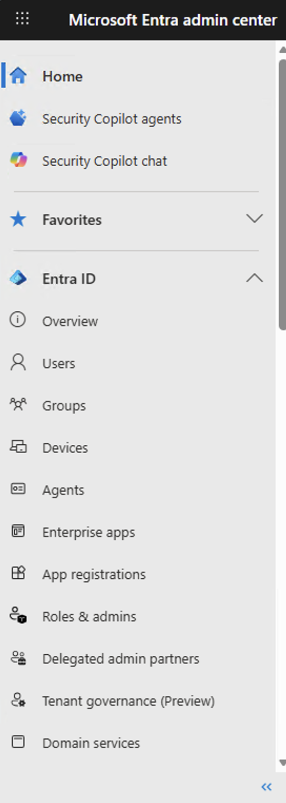 | 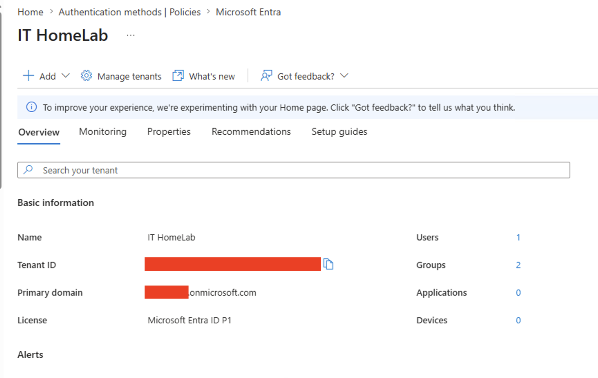 |

| Tenant Properties | Configured Domain Names |
|:-----------------:|:-----------------------:|
| 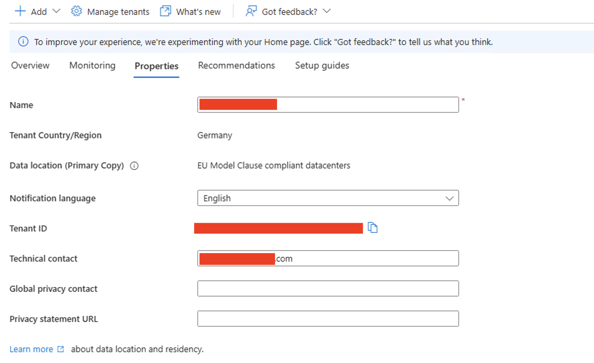 | 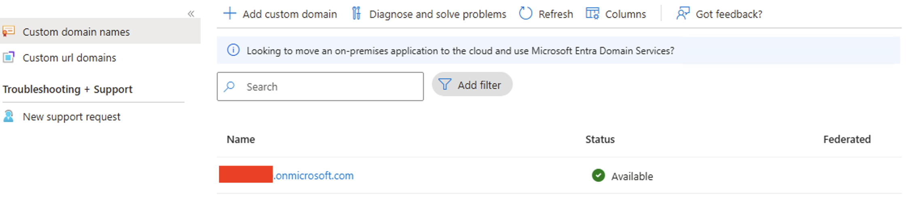 |

---

## 3. User Management

Cloud-only users were created to simulate employees who are managed directly in Microsoft Entra ID. I also explored common user management tasks such as updating user information, resetting passwords, and temporarily disabling user accounts.

### Create Cloud Users
| Create User (Basics) | Review and Create |
|:--------------------:|:-----------------:|
| 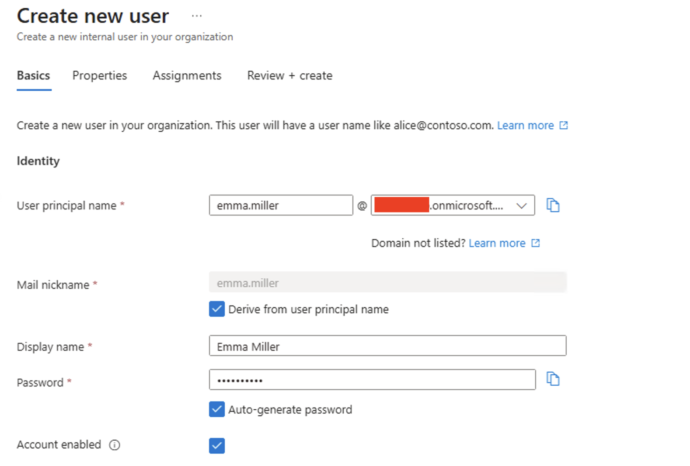 | 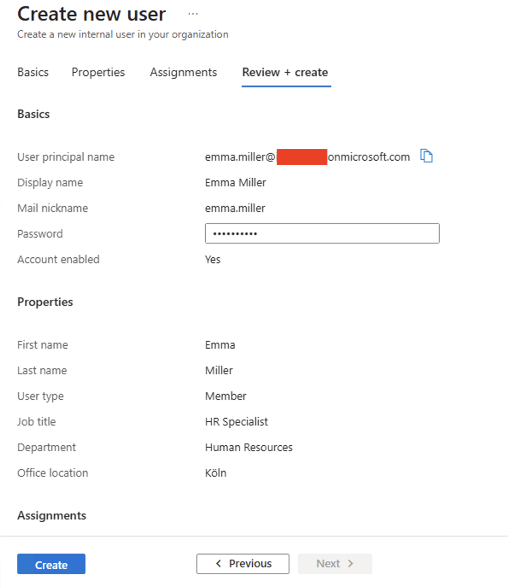 |

### Manage Users
After creating the users, I updated some profile information such as the job title and office location, tested the password reset function, and verified how to disable an account.

| All Users List | Reset Password Options |
|:--------------:|:----------------------:|
| 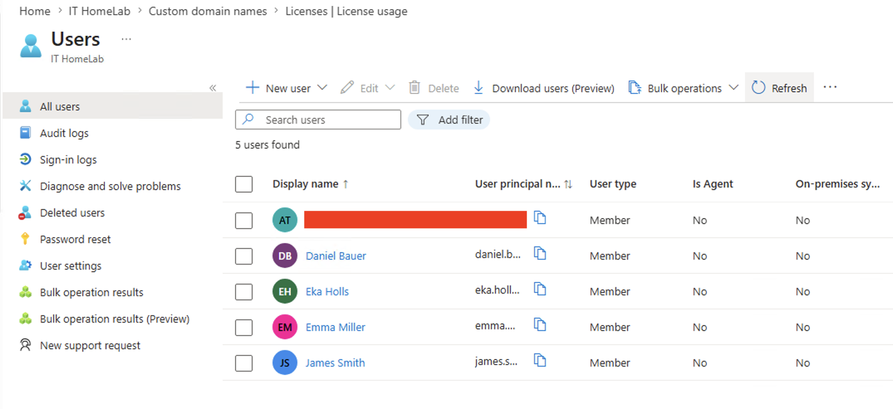 | 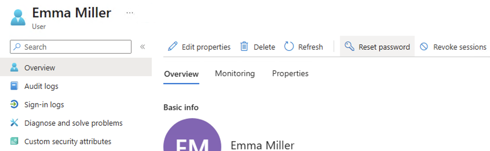 |

| User Properties (Before) | User Properties (Updated) | Disable Account Status |
|:------------------------:|:-------------------------:|:----------------------:|
| 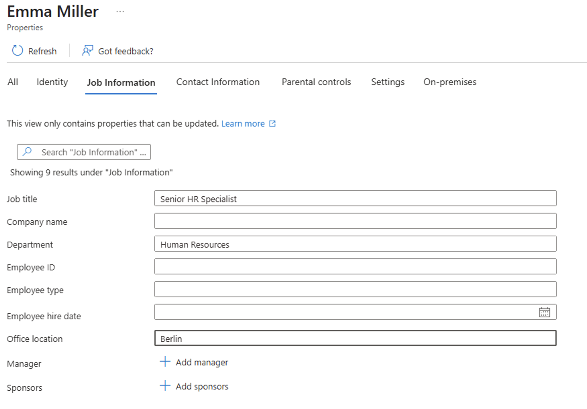 | 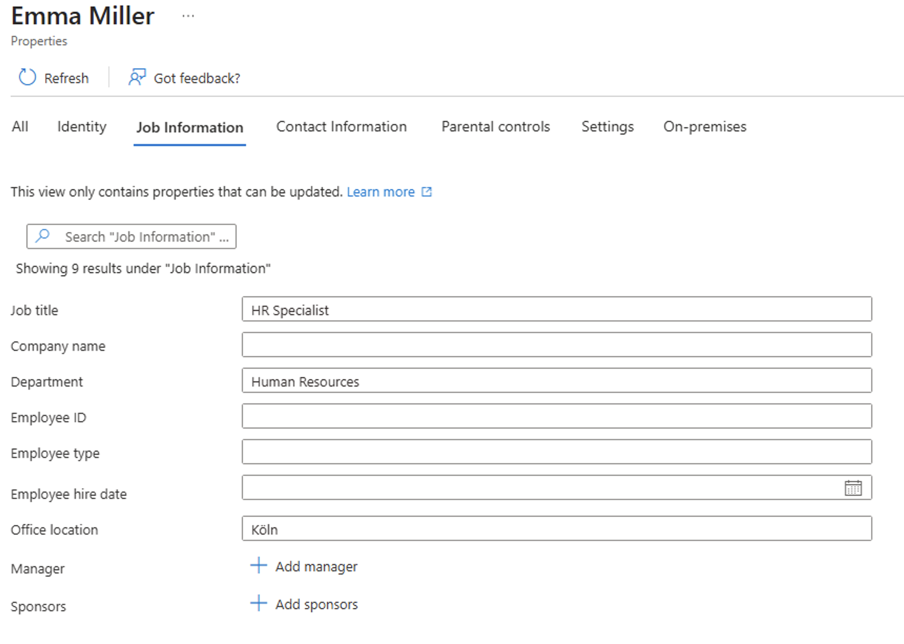 | 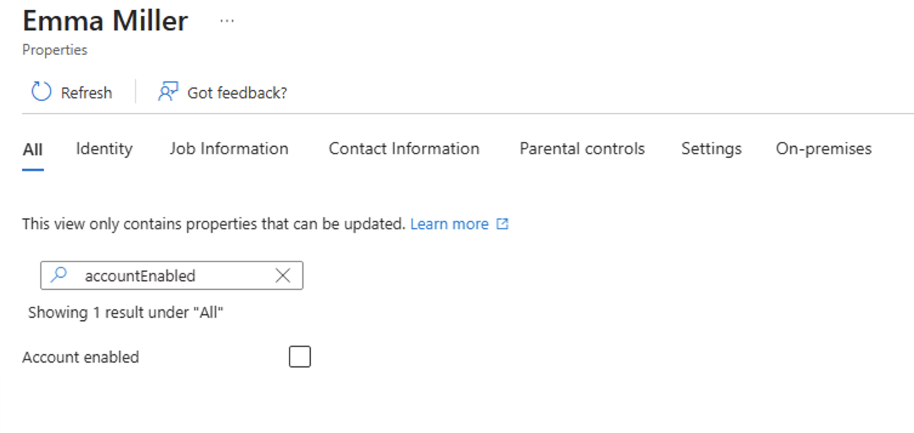 |

---

## 4. Group Management

To organize cloud-only users, I created a Security Group named **Remote Contractors** and added selected users as members. This group represents identities that exist only in Microsoft Entra ID and are not synchronized from the on-premises Active Directory environment.

| Create Security Group | All Groups List | Group Members |
|:---------------------:|:---------------:|:-------------:|
| 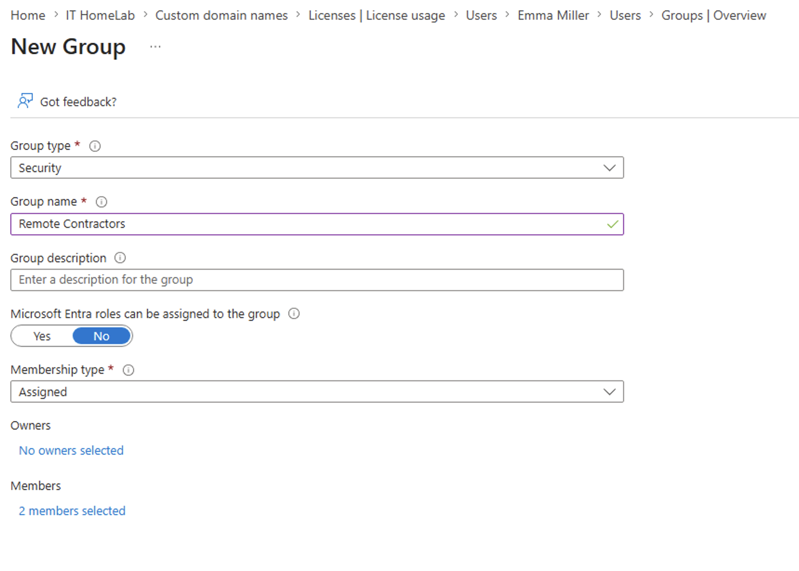 | 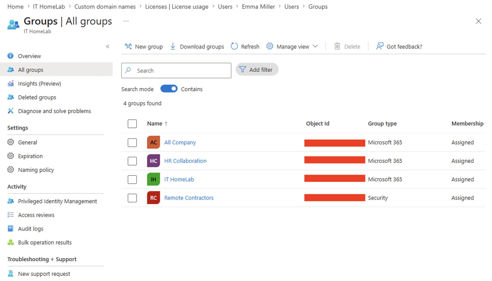 | 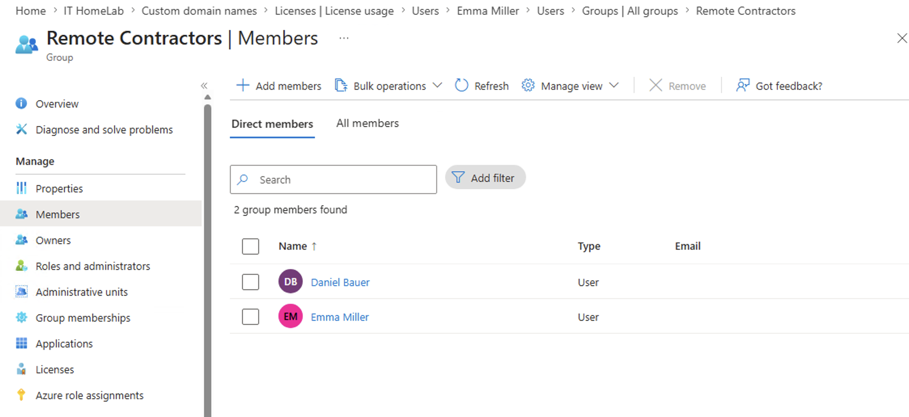 |

---

## 5. Administrative Roles

Microsoft Entra ID provides many built-in administrative roles.

During this phase, I explored the available roles and reviewed the purpose of the User Administrator role.

| Administrative Roles List | User Administrator Role Details |
|:-------------------------:|:-------------------------------:|
| 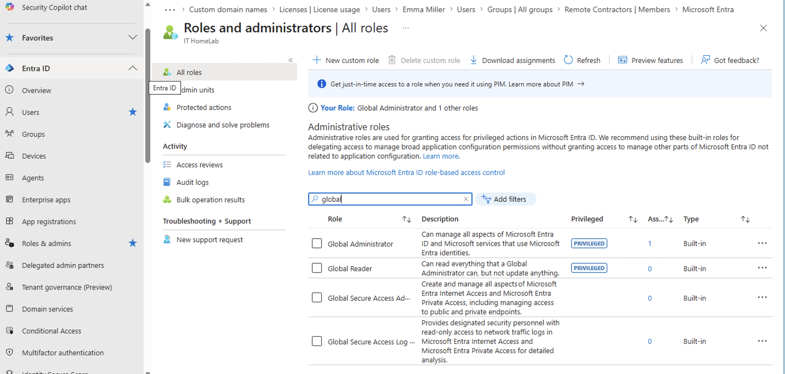 | 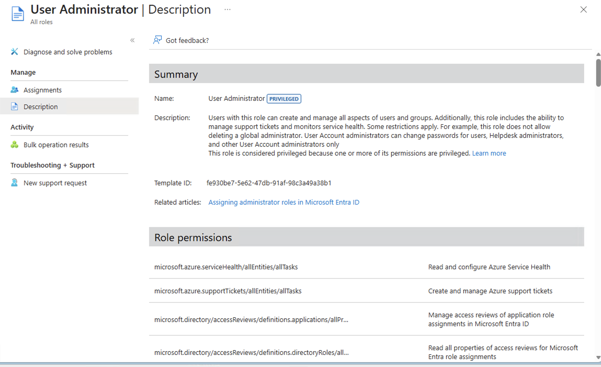 |

---

## 6. License Overview

The tenant uses a **Microsoft 365 Business Premium Trial** subscription. During this phase, I reviewed the available licenses and verified the current license usage.

| Microsoft 365 License Status |
|:----------------------------:|
| 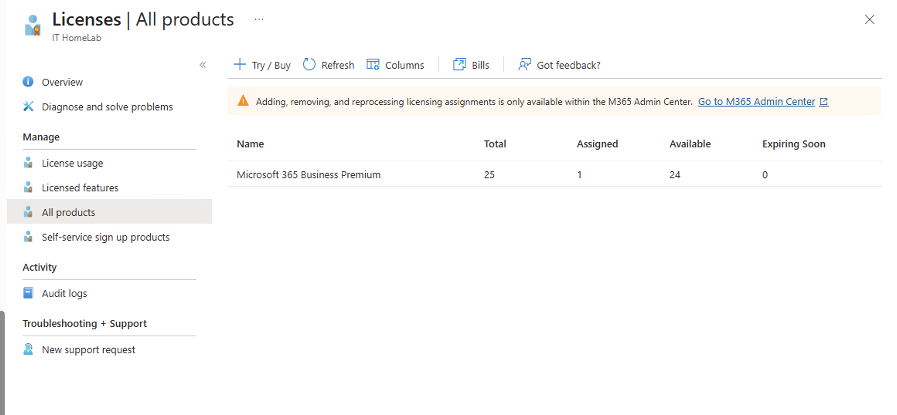 |

- **Product:** Microsoft 365 Business Premium Trial
- **Total licenses:** 25
- **Assigned:** 1
- **Available:** 24

---

## 7. Best Practices

- Follow the principle of least privilege.
- Assign administrative roles only when necessary (e.g., using User Administrator instead of Global Administrator for standard tasks).
- Use Security Groups to simplify access management instead of managing users individually.
- Keep user information up to date.
- Regularly review user accounts and group memberships.

---

## 8. Lessons Learned

- Unlike Active Directory, Microsoft Entra ID does not use Organizational Units (OUs). User organization is primarily handled through groups and administrative roles.
- Security Groups and Microsoft 365 Groups are the primary methods for organizing users and assigning permissions in cloud environments.
- The Microsoft Entra admin center has a clean and intuitive interface, making common administrative tasks easy to perform.
- User profiles can store useful organizational information such as department, job title, and office location.
- Working with Microsoft Entra ID helped me better understand how cloud identity management differs from traditional Active Directory.

---

## Summary

In this phase, I explored the Microsoft Entra admin center and learned the fundamentals of cloud identity management. I created and managed cloud-only users, organized users with Security Groups, explored built-in administrative roles, and reviewed Microsoft 365 licensing information. 

This phase provided a solid understanding of Microsoft Entra ID administration and prepared the lab environment for the upcoming security and hybrid identity configurations.

---

## Navigation

| Previous | Home | Next |
|:--------:|:----:|:----:|
| ⬅️ [Phase 13: Cloud Environment Preparation](../13-Cloud-Environment-Preparation/README.md) | 🏠 [Home](../../README.md) | ➡️ Phase 15: *(Coming Soon)* |
