# Phase 15 – Microsoft Entra ID Security

> **Status:** ✅ Completed

---

## Overview

Microsoft Entra ID provides built-in security features to protect user identities and reduce the risk of unauthorized access.

In this phase, I configured the Microsoft Entra ID security features available in my environment and reviewed several built-in security settings and recommendations. This included authentication methods, Multi-Factor Authentication (MFA), Self-Service Password Reset (SSPR), password protection, an emergency administrator account, and Identity Secure Score.

---

## Objectives

- Review Authentication Methods.
- Enable and test Microsoft Authenticator.
- Configure Multi-Factor Authentication (MFA).
- Review Self-Service Password Reset (SSPR) settings.
- Create an Emergency Administrator account (Break-Glass account).
- Review Password Protection settings.
- Review Identity Secure Score recommendations.

---

## Technologies Used

- Microsoft Entra ID
- Microsoft Entra Admin Center
- Microsoft 365 Admin Center
- Microsoft Authenticator

---

## 1. Emergency Administrator Account (Break-Glass)

Before configuring tenant-wide security policies, I created an Emergency Administrator (Break-Glass) account and assigned it the **Global Administrator** role. 

A highly complex password was configured for this account. Multi-Factor Authentication (MFA) was intentionally **not** configured for this specific account. Its primary purpose is to provide emergency administrative access if normal authentication methods (like the MFA service) experience a global outage or become unavailable. 

| Create Emergency Admin | Assign Global Administrator Role |
|:----------------------:|:--------------------------------:|
| 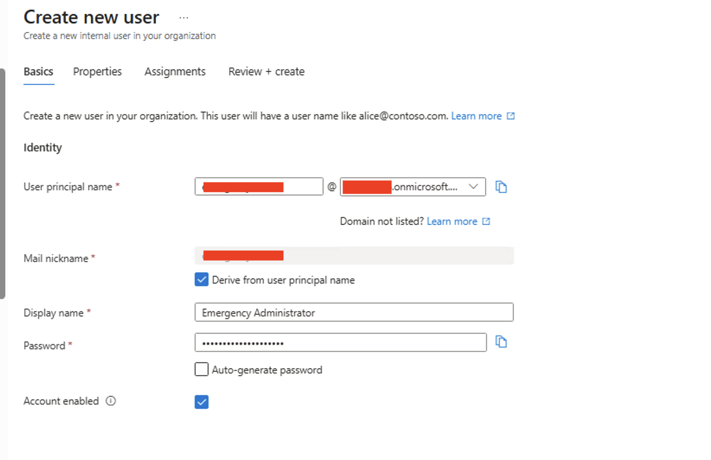 | 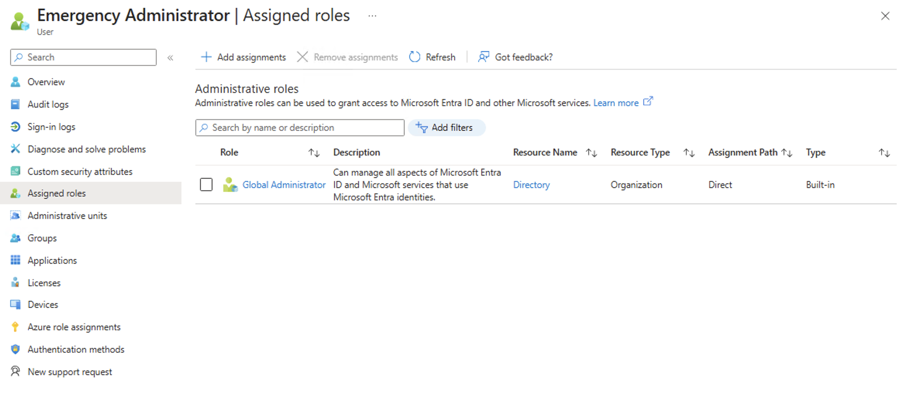 |

---

## 2. Authentication Methods

I reviewed the available authentication methods supported by Microsoft Entra ID and verified the Microsoft Authenticator settings for the tenant.

Microsoft Authenticator was enabled for all users, and number matching was configured to provide additional protection against MFA fatigue attacks.

| Authenticator Settings (Enable) | Authenticator Settings (Configure) |
|:-------------------------------:|:----------------------------------:|
| 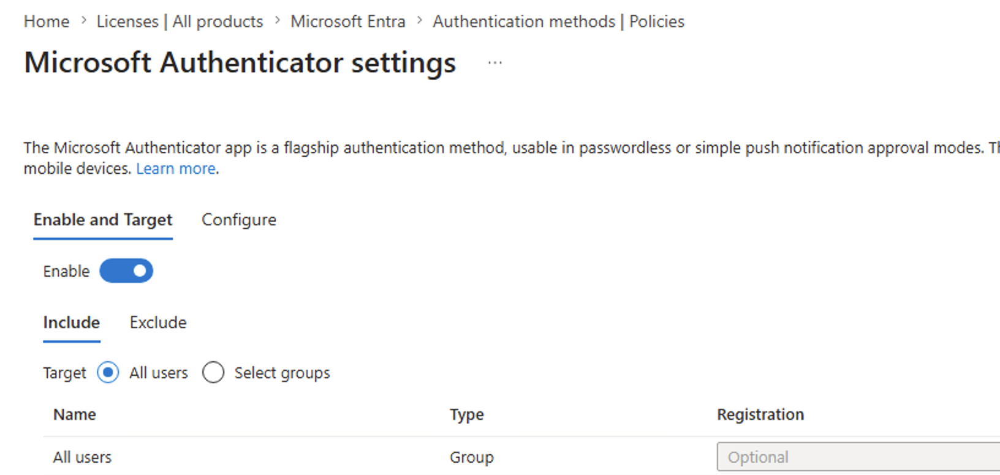 | 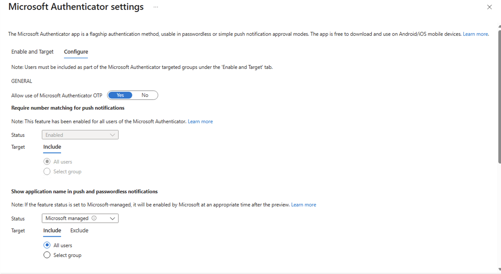 |

---

## 3. Multi-Factor Authentication (MFA)

Microsoft is gradually enforcing MFA across Azure and Microsoft Entra services. I acknowledged the Phase 2 enforcement warnings in the admin center.

I configured MFA using Microsoft Authenticator for my regular administrative account and successfully tested the sign-in process. Authentication requests were successfully approved through the Microsoft Authenticator app using number matching.

| Azure MFA Enforcement Notice | Microsoft Authenticator Prompt |
|:----------------------------:|:------------------------------:|
| 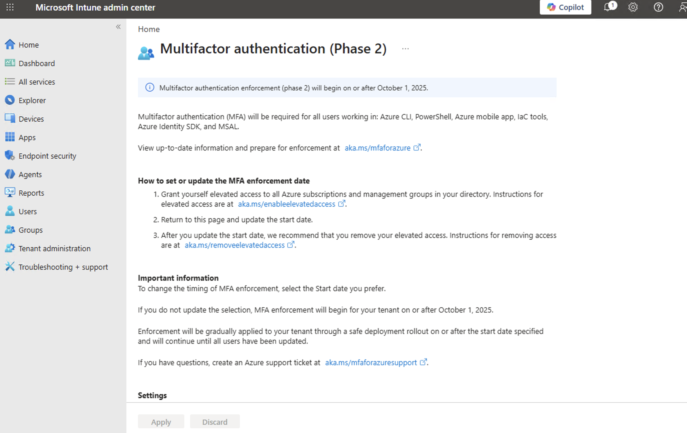 | 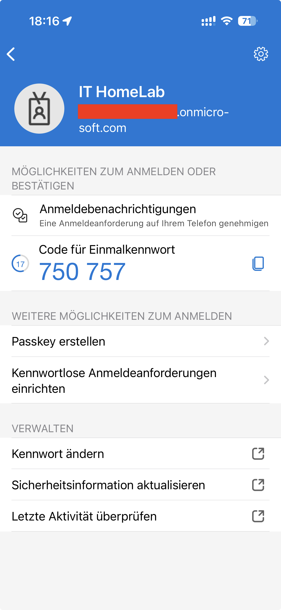 |

---

## 4. Self-Service Password Reset (SSPR)

I reviewed the available Self-Service Password Reset (SSPR) settings supported by Microsoft Entra ID Free.

By default, users are prompted to reconfirm their authentication information every 180 days.

| SSPR Properties | SSPR Registration Settings |
|:---------------:|:--------------------------:|
| 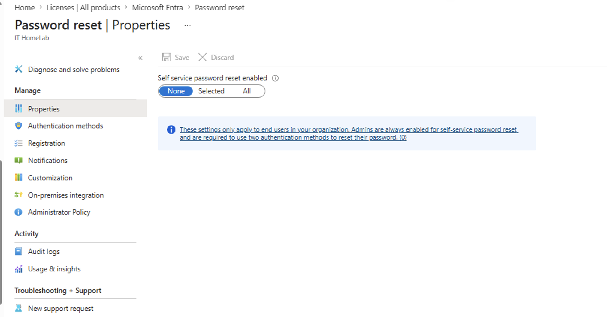 | 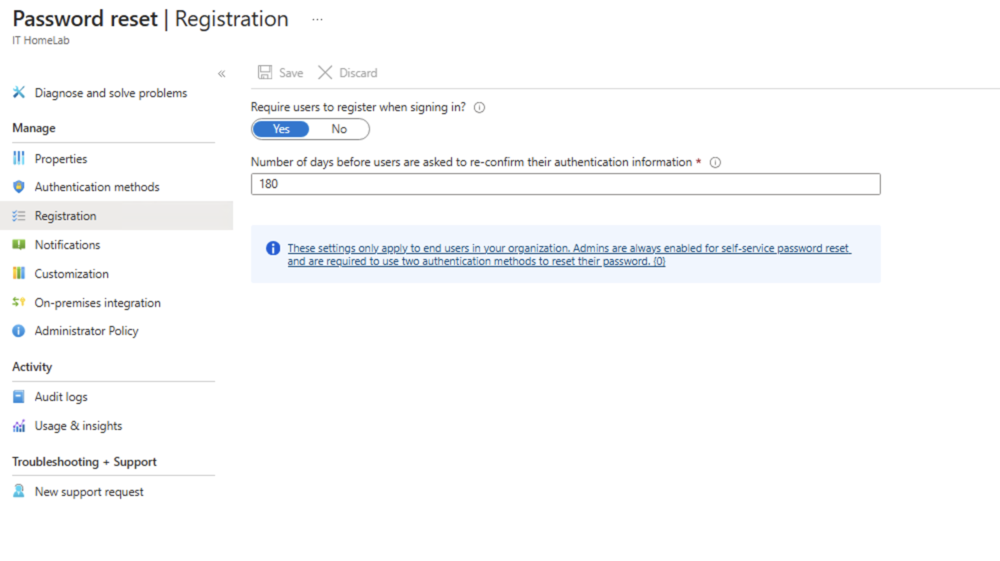 |

---

## 5. Password Protection

Microsoft Entra Password Protection prevents users from choosing weak, easily guessable, or commonly compromised passwords. 

I reviewed the Password Protection configuration available in Microsoft Entra ID.

The default Smart Lockout settings were left unchanged, and custom banned passwords were not configured because this feature requires a premium license. Microsoft's global banned password list remains active by default.

| Password Protection Settings |
|:----------------------------:|
| 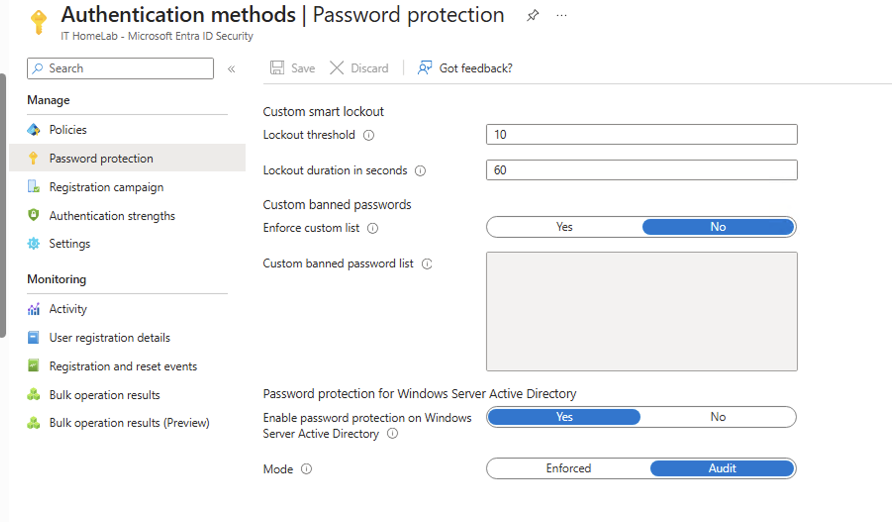 |

---

## 6. Identity Secure Score

Finally, I reviewed the Identity Secure Score dashboard to evaluate the current security posture of the tenant.

The recommendations highlighted several best practices and provided guidance for future improvements.

| Identity Secure Score Dashboard | Security Recommendations |
|:-------------------------------:|:------------------------:|
| 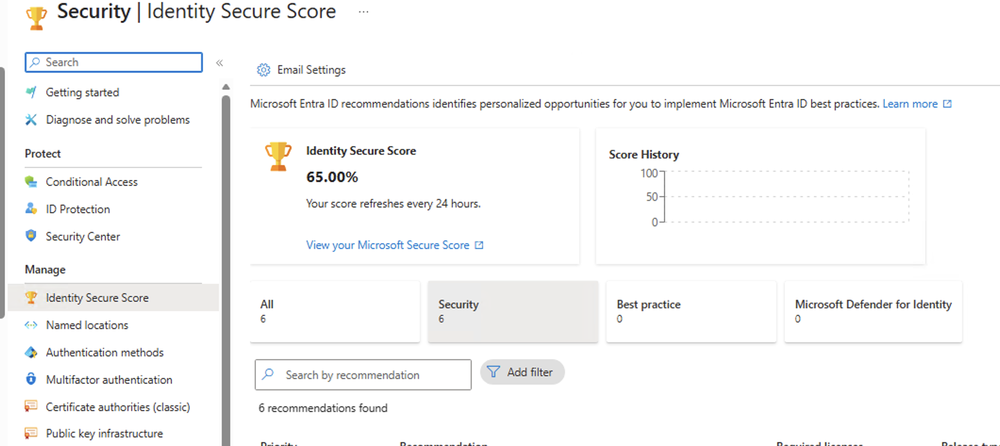 | 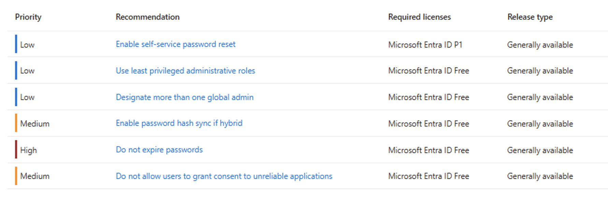 |

---

## Lessons Learned

- **Break-Glass** accounts require careful planning. In this HomeLab, the emergency administrator account was intentionally left without MFA so it could be used if normal MFA services became unavailable.
- **MFA is Critical:** Multi-Factor Authentication greatly improves account security and should be enabled for all administrative accounts.
- **Number Matching:** Enabling number matching in Microsoft Authenticator prevents "MFA fatigue" (where attackers spam approvals hoping the user clicks "Approve" by accident).
- **SSPR:** Self-Service Password Reset can significantly reduce IT Helpdesk effort while allowing users to recover access securely.
- **Password Protection:** Built-in password protection helps reduce the risk of weak or commonly used passwords across the organization.
- **Continuous Improvement:** Identity Secure Score provides excellent, actionable guidance for improving Microsoft Entra security over time.

---

## Navigation

| Previous | Home | Next |
|:--------:|:----:|:----:|
| ⬅️ [Phase 14: Microsoft Entra ID Fundamentals](../14-Microsoft-Entra-ID-Fundamentals/README.md) | 🏠 [Home](../../README.md) | ➡️ [Phase 16: Microsoft Entra ID Connect Cloud Sync](../16-Microsoft-Entra-ID-Connect-Cloud-Sync/README.md) |
