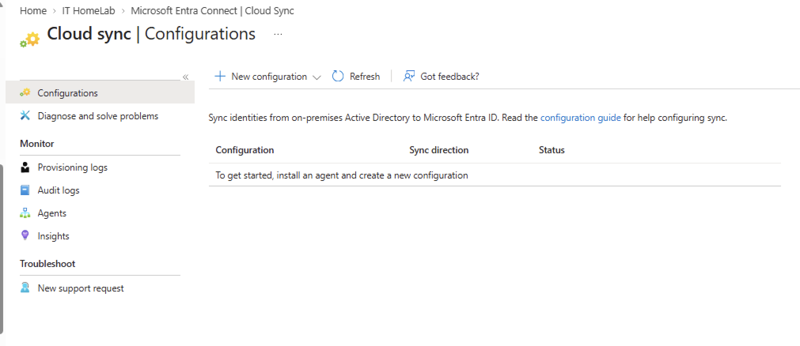
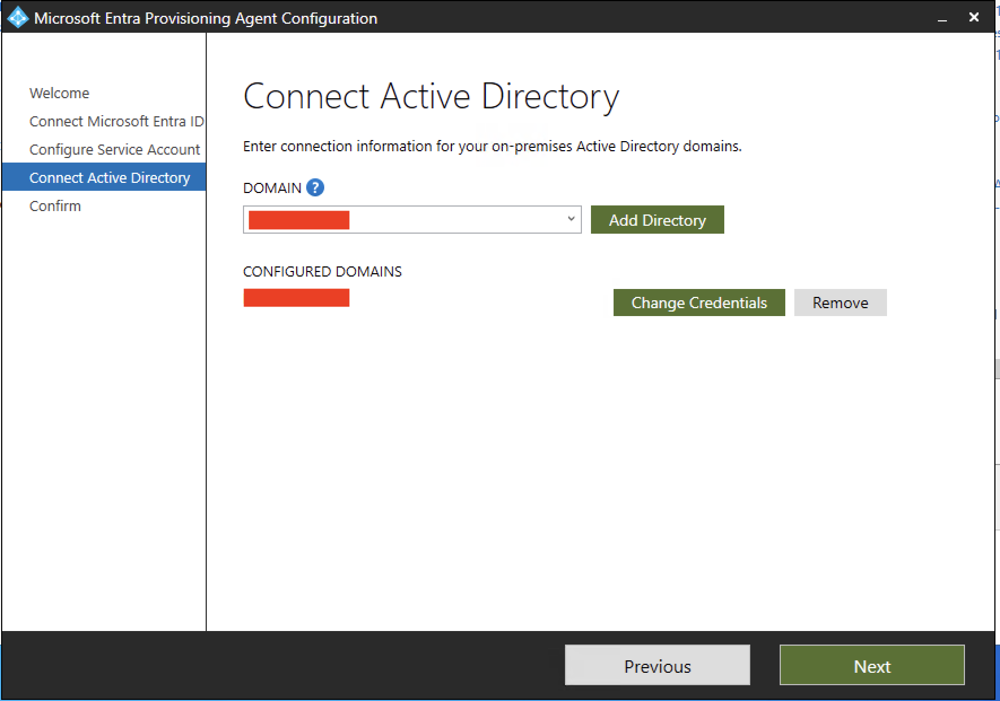
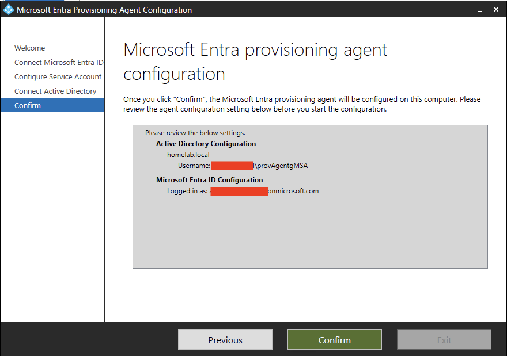
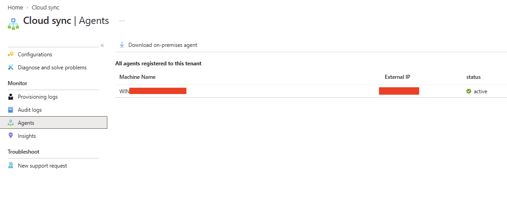
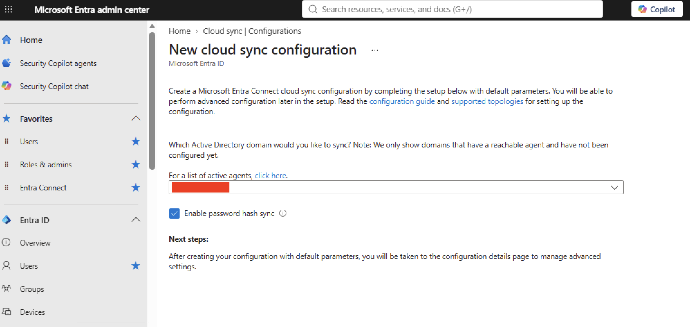
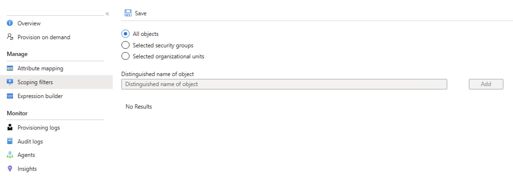
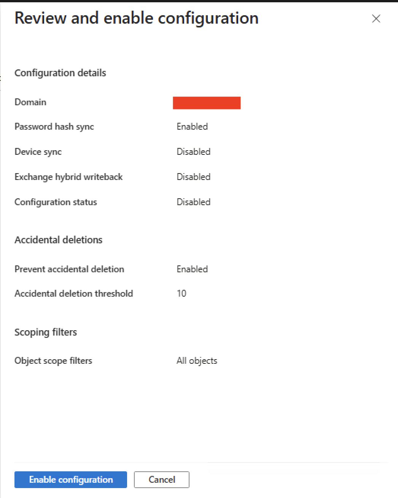
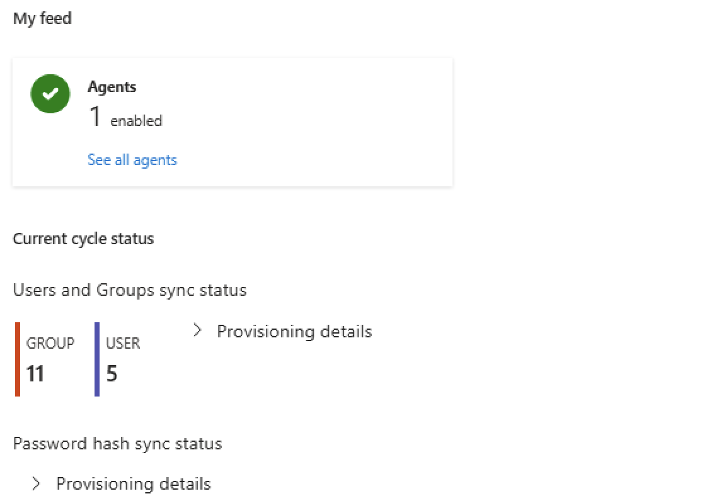
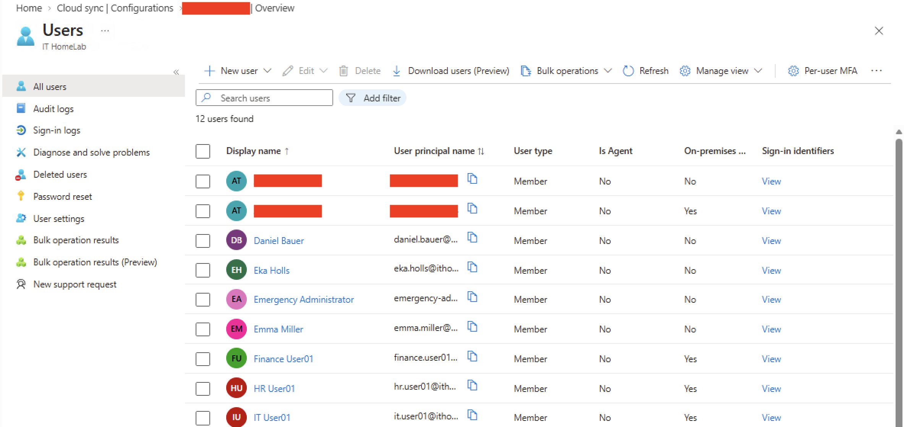
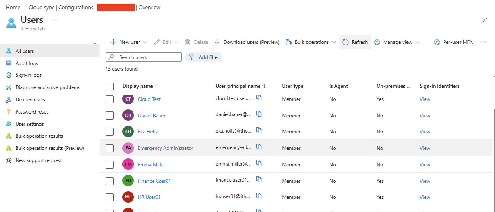

# Phase 16 – Microsoft Entra Connect Cloud Sync

> **Status:** ✅ Completed

---

## Overview

Microsoft Entra Connect Cloud Sync allows Active Directory users to be synchronized with Microsoft Entra ID without deploying the traditional Microsoft Entra Connect Sync server.

In this phase, I installed the Microsoft Entra Provisioning Agent, created a Cloud Sync configuration, enabled Password Hash Synchronization, and verified that new Active Directory users were automatically synchronized to Microsoft Entra ID.

---

## Objectives

- Install the Microsoft Entra Provisioning Agent
- Configure Microsoft Entra Connect Cloud Sync
- Enable Password Hash Synchronization (PHS)
- Synchronize Active Directory users with Microsoft Entra ID
- Verify Hybrid Identity is working correctly

---

## Before Configuration

Before starting the configuration, no Provisioning Agent was registered and no Cloud Sync configuration existed in the tenant.

| Cloud Sync (Before) |
|:-------------------:|
|  |

---

## What is the Provisioning Agent?

The Microsoft Entra Provisioning Agent is a small service that connects the on-premises Active Directory to Microsoft Entra ID. 

The Provisioning Agent does not synchronize users by itself. Its job is to create a secure connection between the local domain and Microsoft Entra ID. The actual synchronization starts after a Cloud Sync configuration is created in the cloud portal.

---

## Provisioning Agent Installation

I downloaded and installed the Microsoft Entra Provisioning Agent on my domain controller.

During the installation, I completed the following steps:
1. Signed in with my Microsoft Entra Global Administrator account.
2. Connected the local Active Directory domain (`homelab.local`).
3. Allowed the installer to create a Group Managed Service Account (gMSA).
4. Registered the server as a Cloud Sync agent.

After the installation was finished, the server was ready for Cloud Sync configuration.

| Connect Active Directory | Confirm Agent Configuration |
|:------------------------:|:---------------------------:|
|  |  |

---

## Cloud Sync Configuration

After the agent became active, I created a new Cloud Sync configuration for the `homelab.local` domain.

| Provisioning Agent Status | New Cloud Sync Configuration |
|:-------------------------:|:----------------------------:|
|  |  |

During the configuration:
- **Password Hash Synchronization (PHS)** was enabled so users can log in with the same password in both environments.

- **Scoping Filters:** For my Home Lab, I synchronized all Active Directory objects.

In a production environment, administrators usually synchronize only selected Organizational Units (OUs) or Security Groups.

- **Accidental Deletions:** Accidental deletion protection was enabled. The accidental deletion threshold was changed from the default 500 down to **10**. 

After reviewing the settings, I enabled the synchronization.

| Scoping Filters | Review and Enable Configuration |
|:---------------:|:-------------------------------:|
|  |  |

---

## Validation

After enabling Cloud Sync, I checked that everything was working correctly.

First, I confirmed that the initial synchronization completed successfully. Next, I verified that the existing on-premises Active Directory users (such as IT User, Finance User, etc.) were synchronized successfully into the cloud.

| Sync Status Overview | Synced Users List |
|:--------------------:|:-----------------:|
|  |  |

Finally, I created a new Active Directory user named Cloud Test to verify that the synchronization was working correctly.

| Cloud Test User Synced Automatically |
|:------------------------------------:|
|  |

---

## Troubleshooting

**Internet Explorer Enhanced Security Configuration (IE ESC)**
During the installation of the Provisioning Agent, the Microsoft sign-in window did not open properly because Internet Explorer Enhanced Security Configuration (IE ESC) was enabled on Windows Server. 

To continue the installation, I temporarily disabled IE ESC for the Administrators group in Server Manager. After the installation was completed, it could be enabled again if needed.

---

## Lessons Learned

- The Provisioning Agent only creates the connection between Active Directory and Microsoft Entra ID. User synchronization starts only after a Cloud Sync configuration is created in the portal.
- Password Hash Synchronization (PHS) lets users sign in to Microsoft 365 with the exact same password they use for their local computers.
- The default accidental deletion threshold (500) is too high for a small lab environment. I changed it to 10 because it is more suitable for a small lab environment.
- Cloud Sync automatically synchronizes new users and changes without any manual action.

---

## Navigation

| Previous | Home | Next |
|:--------:|:----:|:----:|
| ⬅️ [Phase 15: Microsoft Entra ID Security](../15-Microsoft-Entra-ID-Security/README.md) | 🏠 [Home](../../README.md) | ➡️ [Phase 17 - Exchange Online Administration](../17-Exchange-Online-Administration/README.md) |
