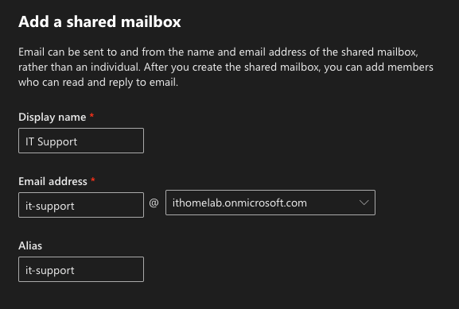
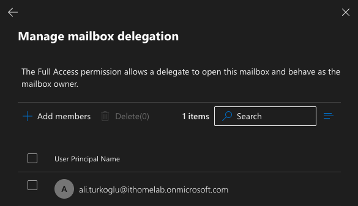
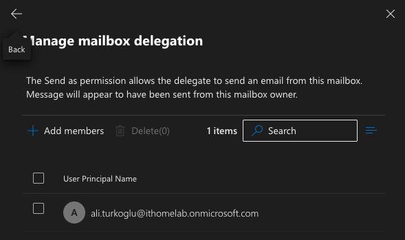
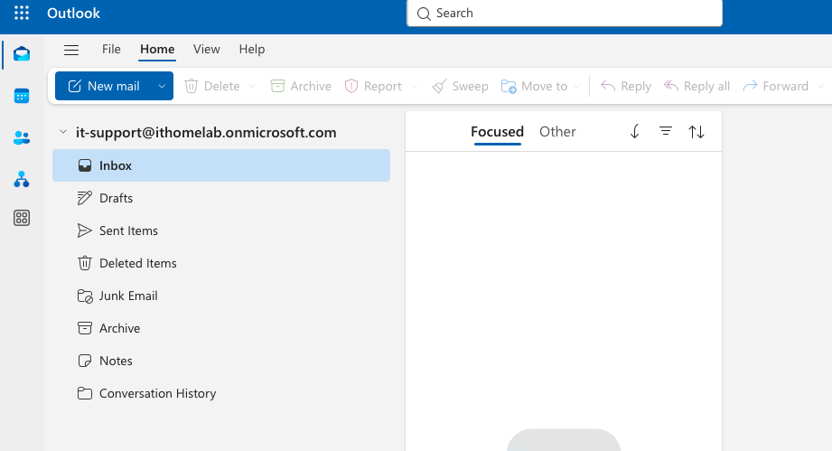
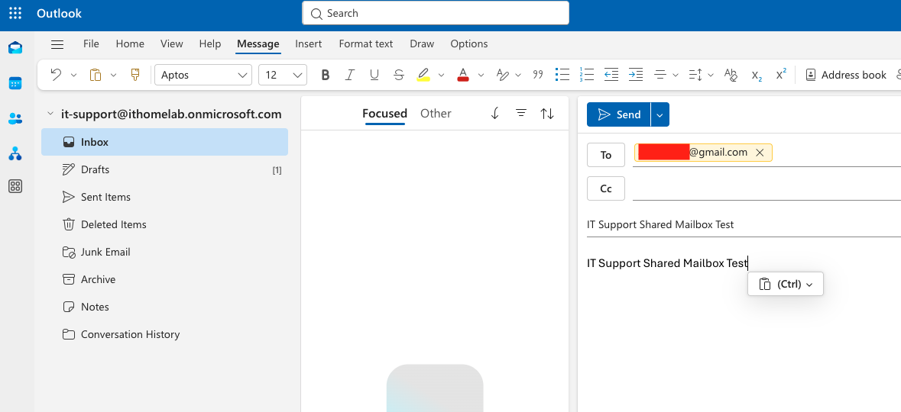
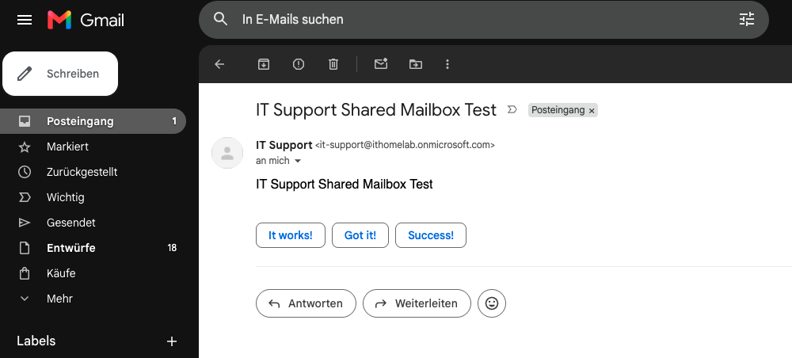
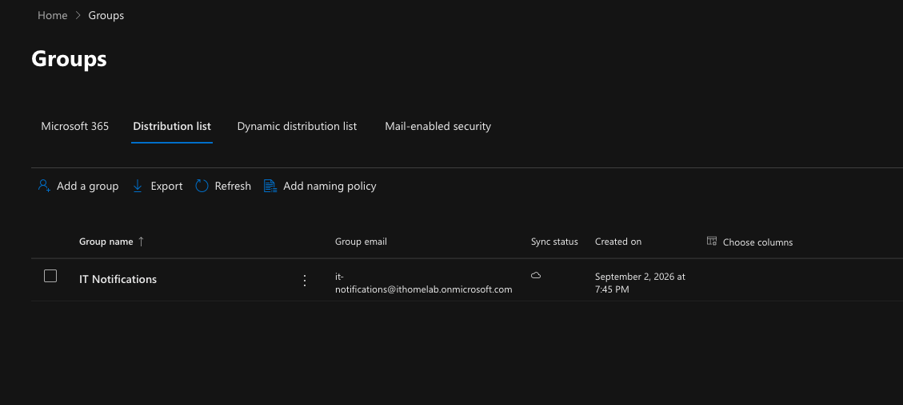
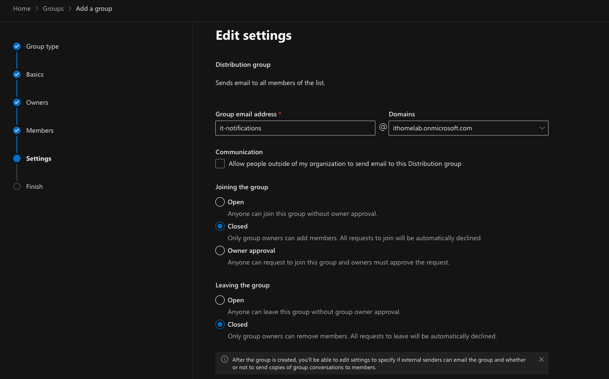
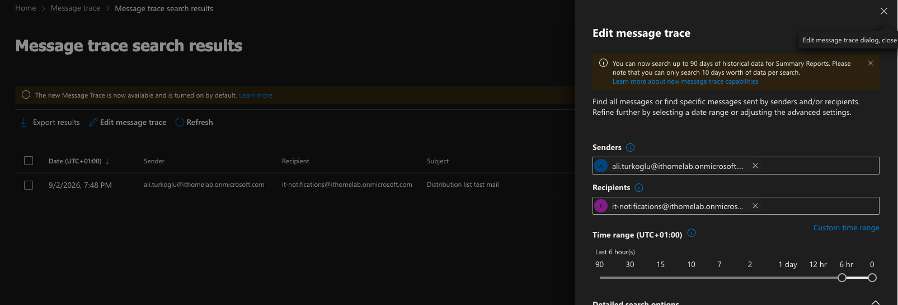
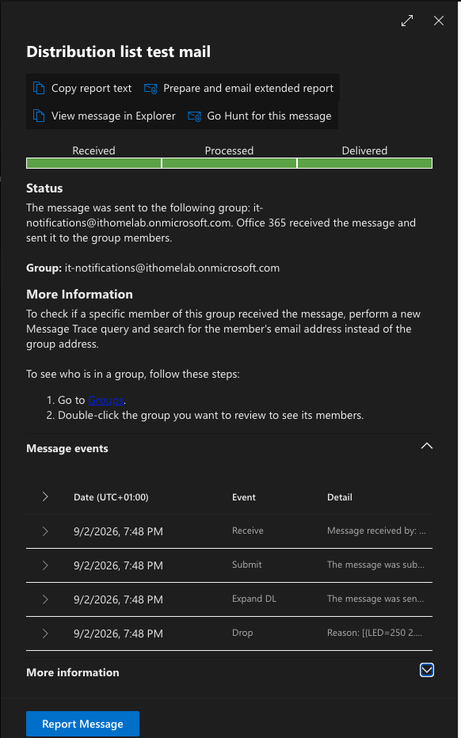

# Phase 17 – Exchange Online Administration

> **Status:** ✅ Completed

---

## Overview

In this phase, I worked with **Exchange Online** to practice common email administration and troubleshooting tasks used in Microsoft 365 environments.

The focus was kept on practical day-to-day administration rather than advanced Exchange configuration.

A shared mailbox and a distribution list were configured, mailbox permissions were tested, email delivery was verified, and Exchange Online troubleshooting tools such as **Message Trace** and **Microsoft Defender Quarantine** were reviewed.

---

## Objectives

- Create and manage a shared mailbox.
- Configure Full Access and Send As permissions.
- Test shared mailbox access through Outlook on the web.
- Verify external email delivery.
- Create and configure a distribution list.
- Test group-based email distribution.
- Use Message Trace for mail delivery troubleshooting.
- Review Microsoft Defender Quarantine.
- Review basic Exchange Online mail flow administration.
- Simulate a common Exchange Online support scenario.

---

## 1. Shared Mailbox

A shared mailbox named **IT Support** was created for departmental communication. Shared mailboxes are commonly used for addresses such as support, helpdesk, finance, or other departmental communication where multiple users need access to the same mailbox.

The mailbox was created as:
- **Display Name:** IT Support
- **Email Address:** `it-support@ithomelab.onmicrosoft.com`

*Note: No additional Microsoft 365 Business Premium license was assigned to the shared mailbox for this HomeLab scenario.*

| Create Shared Mailbox |
|:---------------------:|
|  |

---

## 2. Shared Mailbox Permissions

The licensed user was granted the following permissions on the IT Support shared mailbox:
- **Full Access:** Allows the user to open and manage the contents of the shared mailbox.
- **Send As:** Allows the user to send email using the shared mailbox address instead of their personal mailbox address.

These permissions are configured separately in the Exchange Admin Center.

| Configure Full Access | Configure Send As |
|:---------------------:|:-----------------:|
|  |  |

---

## 3. Shared Mailbox Access Test

The IT Support shared mailbox was opened successfully in Outlook on the web using the licensed user's Full Access permission. This verified that the mailbox permissions had been applied correctly.

| Outlook on the Web (Shared Mailbox Access) |
|:------------------------------------------:|
|  |

---

## 4. Send As and External Delivery Test

A test email was sent from `it-support@ithomelab.onmicrosoft.com` using the Send As permission. The message was sent to an external Gmail account.

The external mailbox displayed IT Support as the sender, confirming that the Send As permission and external mail delivery were working correctly.

| Sending Email from Shared Mailbox | External Mail Delivery (Gmail) |
|:---------------------------------:|:------------------------------:|
|  |  |

---

## 5. Distribution List

A distribution list named **IT Notifications** was created to simulate internal group-based email distribution.

- **Display Name:** IT Notifications
- **Email Address:** `it-notifications@ithomelab.onmicrosoft.com`

The distribution list contained the licensed user mailbox and the IT Support shared mailbox.

The distribution list was configured for internal use with the following settings applied:
- External senders were blocked.
- Joining the group was closed.
- Leaving the group was closed.
- Membership was controlled by the group owner.

| Create Distribution List | Configure Group Settings |
|:------------------------:|:------------------------:|
|  |  |

---

## 6. Distribution List Delivery Test

A test message was sent to `it-notifications@ithomelab.onmicrosoft.com`.

The message was successfully delivered to both the licensed user mailbox and the IT Support shared mailbox. This confirmed that Exchange Online successfully expanded the distribution list and delivered the message to its members.

---

## 7. Message Trace & Distribution List Expansion Verification

Exchange Online **Message Trace** was used to investigate the test message sent to the distribution list. Message Trace is an important administrative tool for troubleshooting situations where users report that an email was delayed, rejected, filtered, or not delivered.

The test message was located by using information such as Sender, Recipient, Time range, and Message subject.

| Message Trace Search | 
|:--------------------:|
|  | 

The detailed Message Trace information showed how Exchange Online processed the message. The trace included events such as Receive, Submit, Expand DL, and Drop. 

The most important event in this scenario was **Expand DL**. This confirmed that Exchange Online successfully expanded the IT Notifications distribution list and processed delivery to its members. The overall message status was Delivered.

| Message Trace Details (Expand DL) |
|:---------------------------------:|
|  |

---

## 8. Microsoft Defender Quarantine & Mail Flow Review

The Microsoft Defender quarantine portal was reviewed as part of daily Exchange Online administration. 

The quarantine area can be used by administrators to investigate messages that have been blocked or isolated because of spam, phishing, malware, or other security policies. No quarantined messages were available during the test, so no configuration changes were required.

The main Exchange Online mail flow administration areas were also reviewed (Mail flow rules, Accepted domains, Connectors). No additional mail flow rules or connectors were created because the current HomeLab environment did not require them. This kept the configuration focused on realistic requirements rather than adding unnecessary settings.

---

## 9. Exchange Online Support Scenario (Troubleshooting Workflow)

A common Exchange Online support scenario was simulated: *A user reports that an email sent to a distribution list was not received by one or more recipients.*

The following troubleshooting workflow was reviewed and applied:

- **Step 1 – Verify Distribution List Membership:** The IT Notifications distribution list was opened in the Exchange Admin Center and its members were verified. This verifies whether the affected user is actually a member of the distribution list.
- **Step 2 – Run Message Trace:** Message Trace was used to locate the original message. The message status and distribution list expansion could then be examined.
- **Step 3 – Trace a Specific Recipient:** A second Message Trace can be performed using the affected user's email address as the recipient. This makes it possible to determine whether Exchange Online delivered, rejected, or filtered the message.
- **Step 4 – Check Quarantine:** If Message Trace indicates that filtering may have occurred, Microsoft Defender Quarantine can be checked for the affected message.

This provides a simple troubleshooting workflow for common Exchange Online mail delivery incidents.

---

## Lessons Learned

- **Permissions:** `Full Access` and `Send As` are separate permissions and must be configured independently. Permission changes may require some propagation time before they become effective.
- **Troubleshooting Order:** Distribution list membership should always be verified before investigating more complex mail delivery problems.
- **Message Trace:** This is a key Exchange Online troubleshooting tool for checking message delivery and distribution list processing.
- **Expand DL:** The `Expand DL` event in Message Trace confirms that Exchange Online successfully expanded a distribution list.
- **Security & Delivery:** Message Trace and Microsoft Defender Quarantine complement each other when troubleshooting mail delivery and filtering issues.
- **Best Practice:** Exchange settings such as rules and connectors should only be configured when there is a real operational requirement to avoid unwanted complexity.

---

## Conclusion

Phase 17 introduced practical Exchange Online administration within the Microsoft 365 HomeLab environment. 

The IT Support shared mailbox was configured and tested without assigning an additional Microsoft 365 Business Premium license. Full Access and Send As permissions were successfully verified through Outlook on the web and external email delivery. 

The IT Notifications distribution list was created and tested, and Message Trace was used to verify how Exchange Online processed and expanded the group message. Microsoft Defender Quarantine and the main Exchange Online mail flow administration areas were also reviewed as part of a realistic troubleshooting workflow. 

With these tasks completed, the HomeLab now includes practical experience with common Exchange Online mailbox, group, mail delivery, and troubleshooting operations.

---

## Navigation

| Previous | Home | Next |
|:--------:|:----:|:----:|
| ⬅️ [Phase 16 – Microsoft Entra Connect Cloud Sync](../16-Microsoft-Entra-ID-Connect-Cloud-Sync/README.md) | 🏠 [Home](../../README.md) | ➡️ [Phase 18: Cloud File Services](../18–Cloud-File-Services/README.md) |
