# Phase 18 – Cloud File Services

> **Status:** ✅ Completed

---

## Overview

In this phase, I worked with Microsoft SharePoint and OneDrive to build a simple cloud file management environment.

The goal was to simulate how a small company could use SharePoint for department collaboration, document management, permissions, secure file sharing, and access from Windows devices.

The main topics covered in this phase were:

- Microsoft 365 Groups
- SharePoint Team Sites
- Document Libraries & Versioning
- SharePoint Permissions & Folder-level permissions
- Secure File Sharing & Permission Verification
- OneDrive Integration & Files On-Demand

---

## Part 1 – SharePoint and Department Sites

### 1. Accessing SharePoint

I started by opening SharePoint from the Microsoft 365 environment. SharePoint is used in this project as the main platform for team collaboration and cloud-based file management.

I also created a simple company portal to represent the main landing page of the company environment.

| SharePoint Start Page | Company Portal Homepage |
|:---------------------:|:-----------------------:|
| 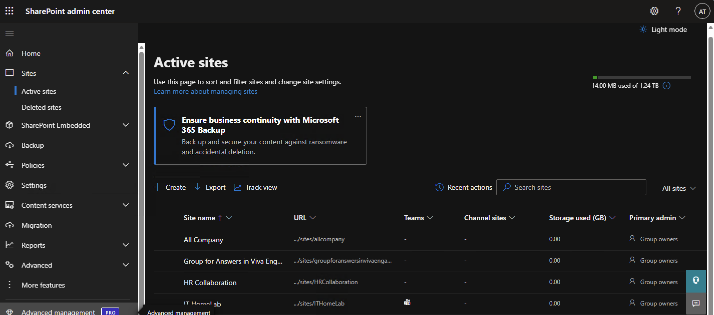 |  |

---

### 2. Creating Department Groups & The IT Team Site

To simulate a real company environment, I created Microsoft 365 Groups for four departments: Finance, HR, IT, and Management. These groups are used to organize users and provide a collaboration area for each department.

For this phase, I mainly worked with the **IT** group because it was used for the SharePoint permission and file-sharing tests. After creating the IT group, SharePoint automatically provided a Team Site for the group. The Team Site was used as the main workspace for the following tests.

| M365 Groups Overview | IT Group Overview | IT Team Site |
|:--------------------:|:-----------------:|:------------:|
| 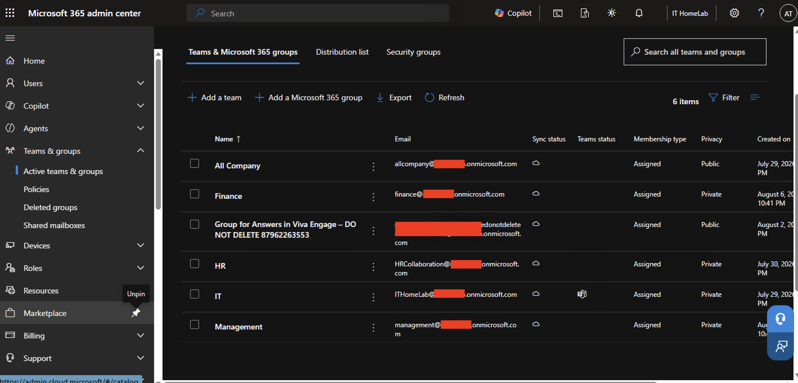 | 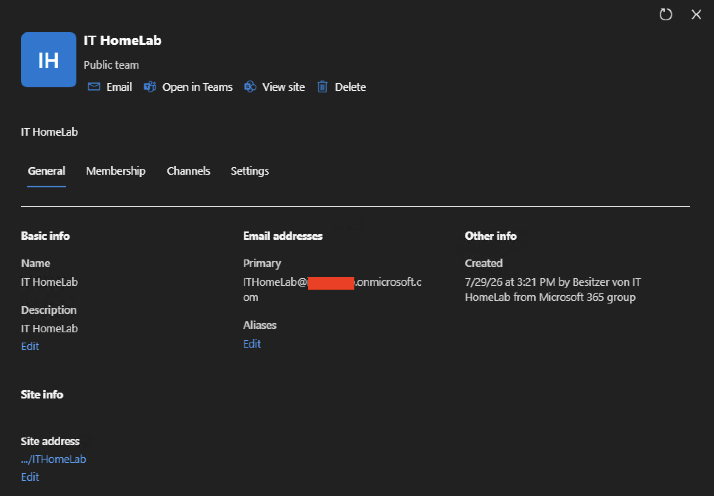 | 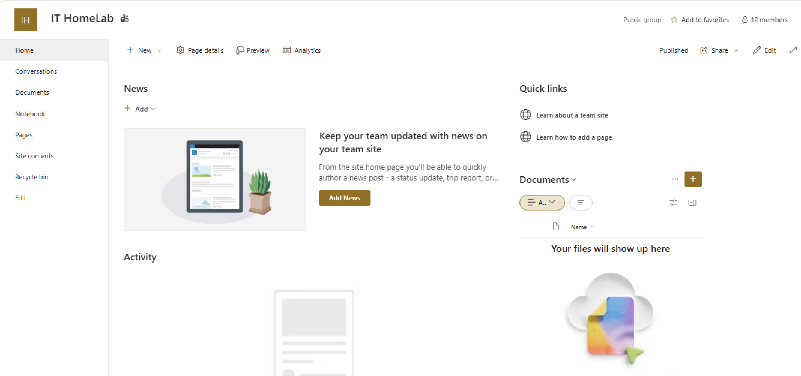 |

---

## Part 2 – Document Libraries and Versioning

### 3. Working with the Document Library & Uploading Documents

The IT Team Site includes a document library for storing and sharing files. I used this library to create a simple folder structure for the IT department (Documentation, PowerShell, Projects, Software, Templates).

I uploaded test documents to the document library to verify the file management and sharing features. The documents can be opened, edited, shared, and managed directly from SharePoint.

| IT Document Library | Document Upload |
|:-------------------:|:---------------:|
| 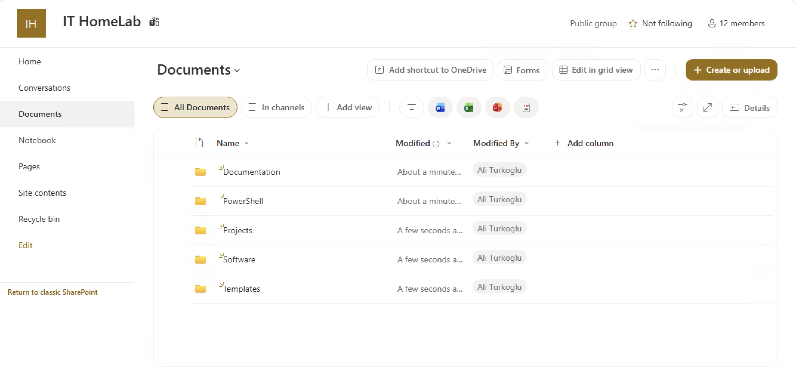 | 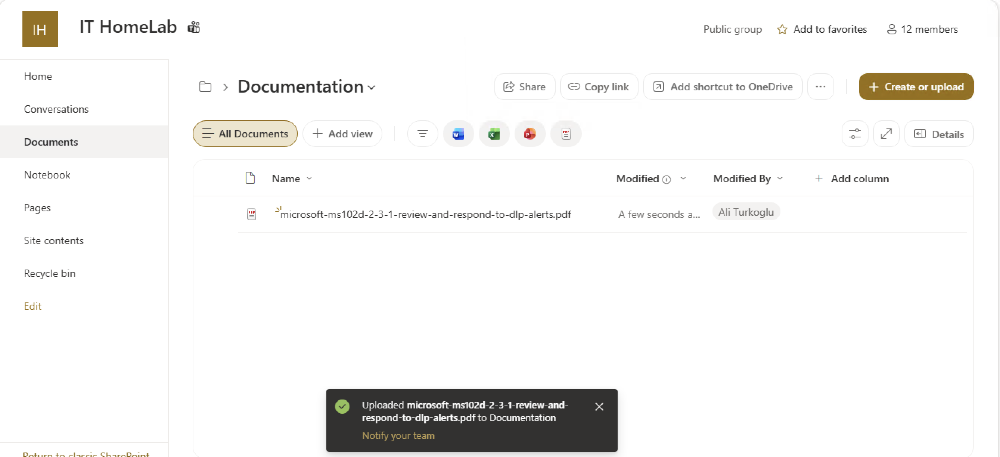 |

---

### 4. Configuring Document Versioning

I configured the document library to use major versioning. This allows SharePoint to keep previous versions of documents when changes are made.

I also added the **Version** column to the document library so that the version information is easier to see. *(Note: The Version column was added mainly for demonstration purposes. In a production environment, it can be hidden if it is not required by users).*

| Versioning Settings | Document Version Column |
|:-------------------:|:-----------------------:|
| 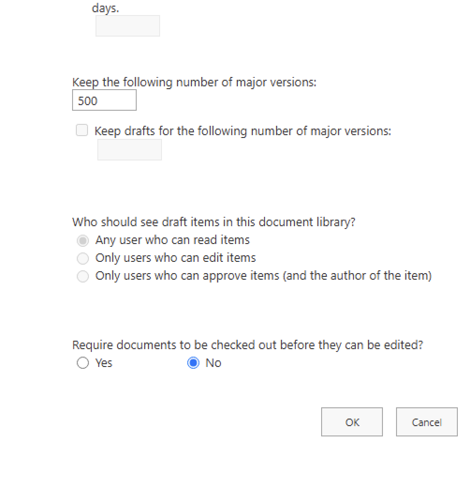 | 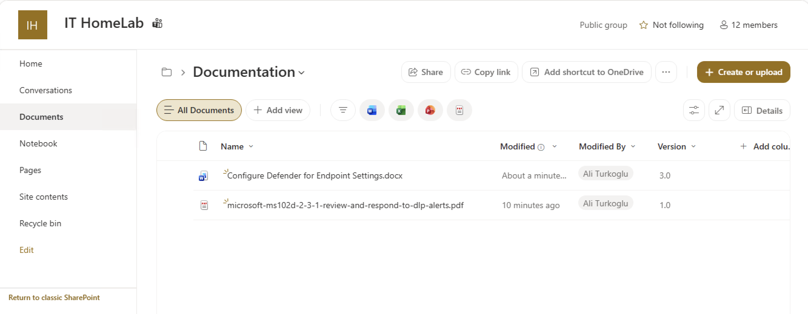 |

---

## Part 3 – SharePoint Permissions

### 5. Reviewing Default Permissions & Creating Unique Permissions

SharePoint provides separate permission groups for site owners, members, and visitors. The default IT site permissions were reviewed before creating custom folder permissions:

- IT Owners → Full Control
- IT Members → Edit
- IT Visitors → Read

The default site permissions are inherited by folders and files. However, for the **Projects** folder, I created unique permissions because the folder required different access from the rest of the document library.

After stopping permission inheritance, the folder had its own permission configuration (IT Visitors were removed). This is useful when a specific folder contains information that should not be available to all site visitors.

| Default IT Site Permissions | Unique Folder Permissions (Projects) |
|:---------------------------:|:------------------------------------:|
| 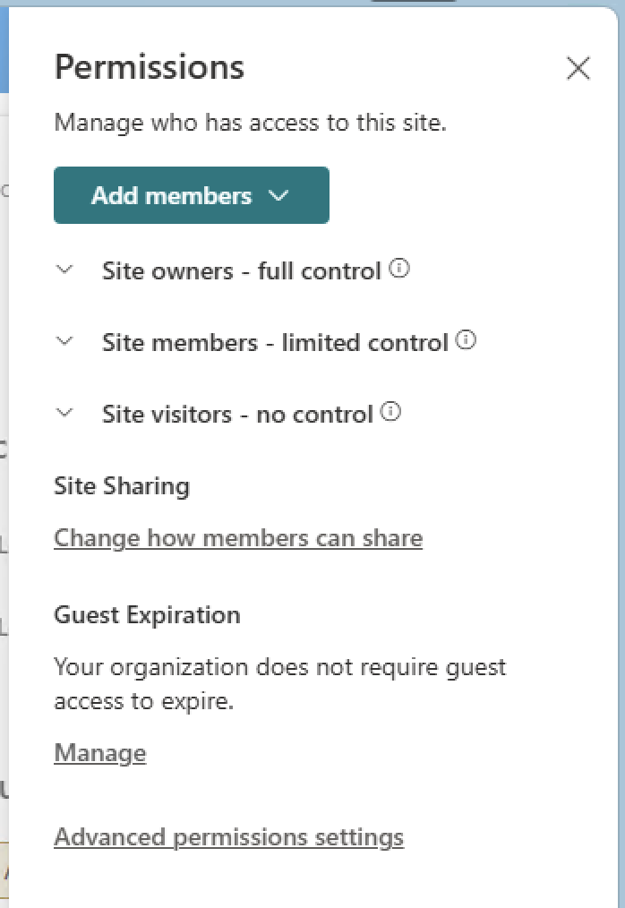 | 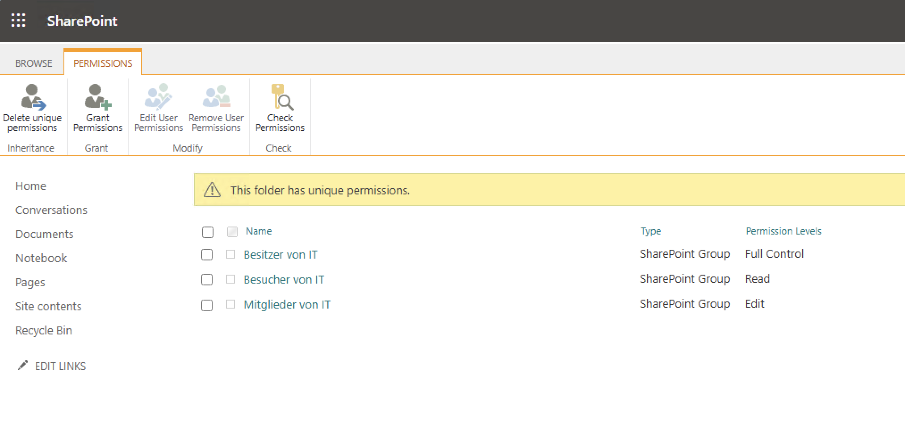 |

---

## Part 4 – Secure File Sharing

### 6. Sharing Files & Managing Access

SharePoint also allows individual files to be shared directly with specific users. For testing, I created a test document and shared it with **IT User01** (Can view permission) and **Manager User01** (Can edit permission).

SharePoint provides a **Manage Access** view where direct users, groups, and sharing links can be reviewed. Direct access can also be removed when it is no longer required.

| Direct User Access (View) | Direct Access (Edit) | Direct Access Removed |
|:-------------------------:|:--------------------:|:---------------------:|
| 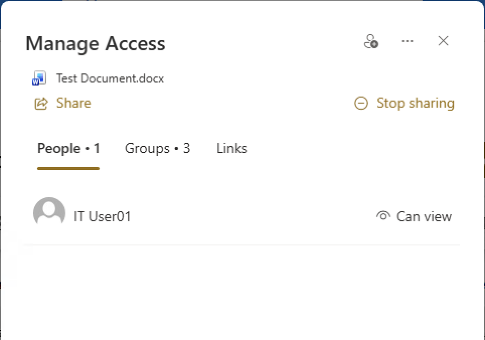 | 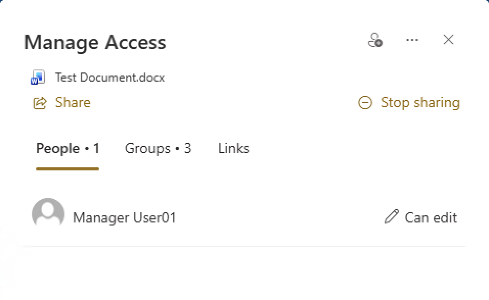 | 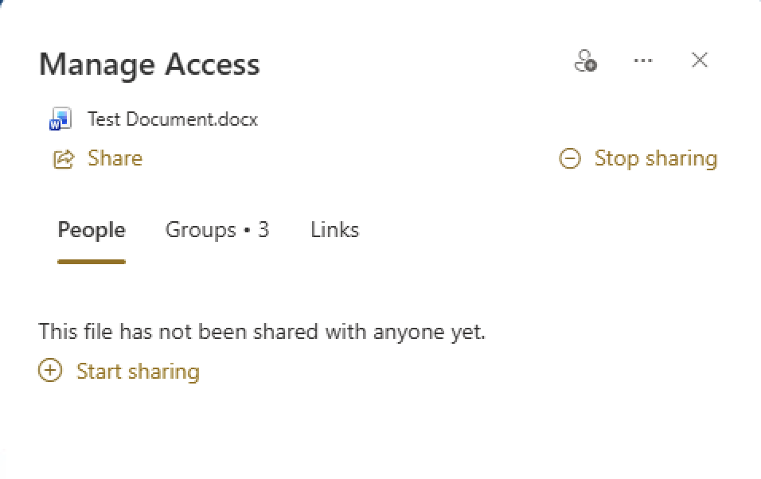 |

---

### 7. Share Link Settings & Permission Levels

SharePoint provides different options when creating a sharing link. For this HomeLab, I used restricted sharing options (Specific people) instead of creating an unrestricted public link. This is closer to a typical company environment where documents should only be available to authorized users.

| Secure Sharing Link Settings | Permission Levels |
|:----------------------------:|:-----------------:|
| 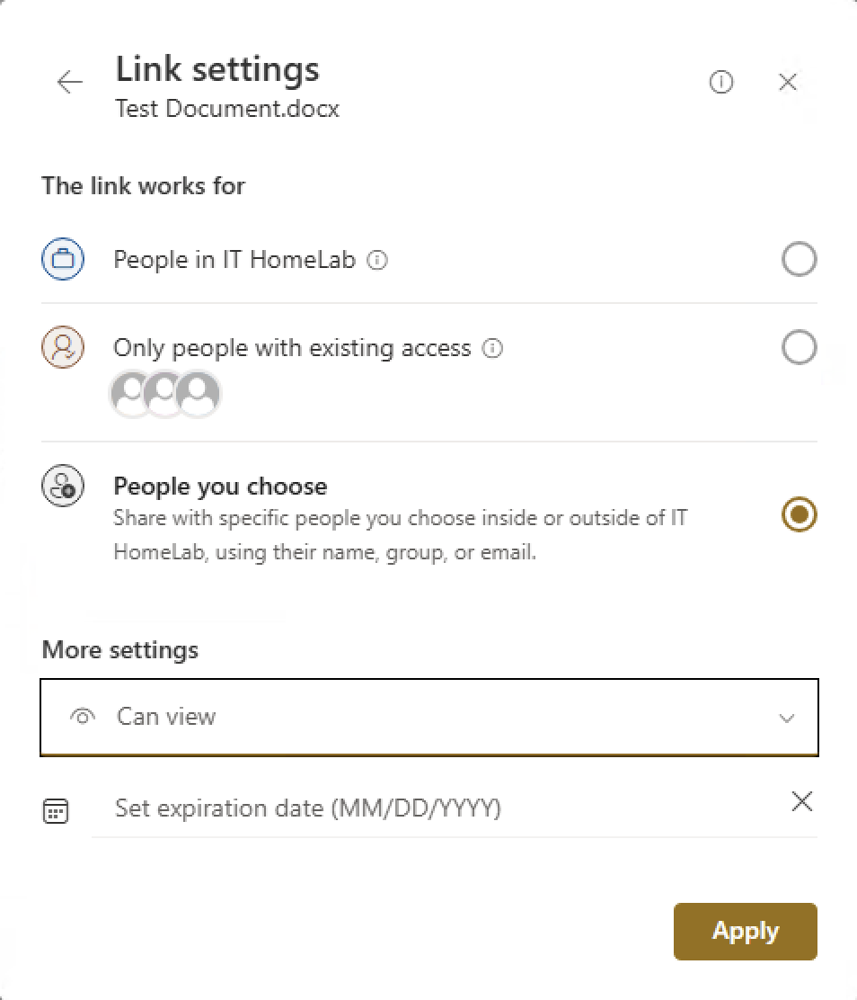 | 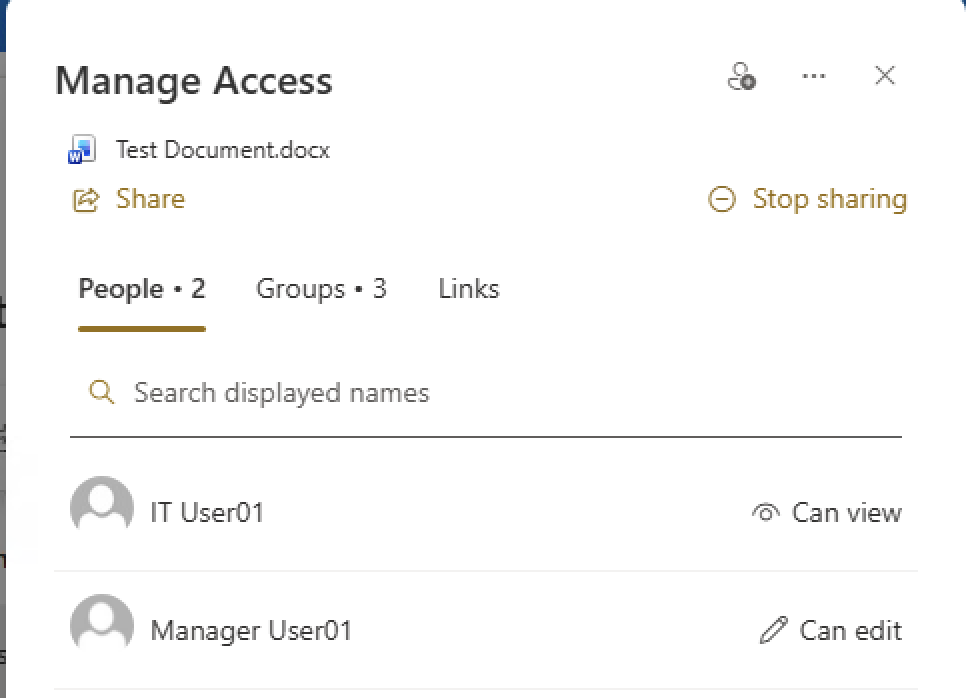 |

---

## Part 5 – Permission Verification

### 8. Checking Effective Permissions

SharePoint provides a **Check Permissions** feature to verify the effective permissions of a user or group. I used this feature to check the permissions of both **IT User01** and **Manager User01**.

The test showed that permissions can come from different sources, such as site permissions, group membership, folder permissions, or direct file access.

| Check Permissions – IT User01 | Check Permissions – Manager User01 |
|:-----------------------------:|:----------------------------------:|
| 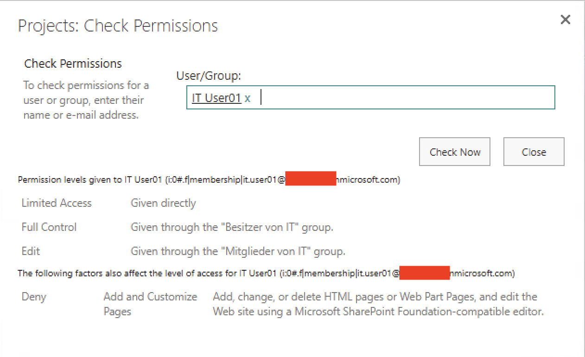 | 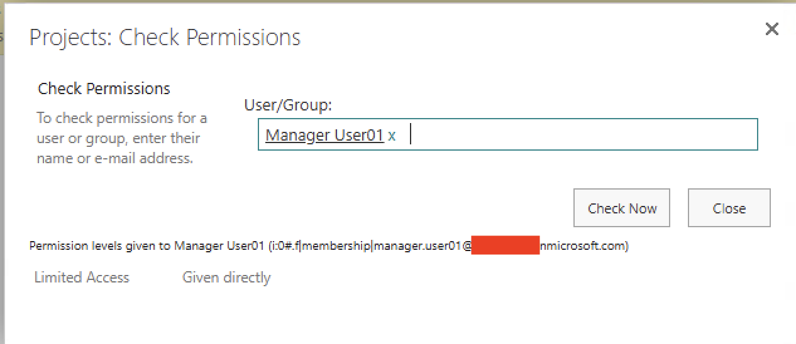 |

---

## Part 6 – OneDrive Integration

### 9. Syncing a SharePoint Library with OneDrive

SharePoint document libraries can be synchronized with the OneDrive desktop application. I used the **Sync** option from the IT document library to connect it to the Windows device.

During the OneDrive setup, I kept the **Files On-Demand** approach. With Files On-Demand, files can remain online-only until they are needed. This helps save local disk space while still allowing users to access their SharePoint files from Windows Explorer.

| OneDrive Sync Prompt |
|:--------------------:|
| 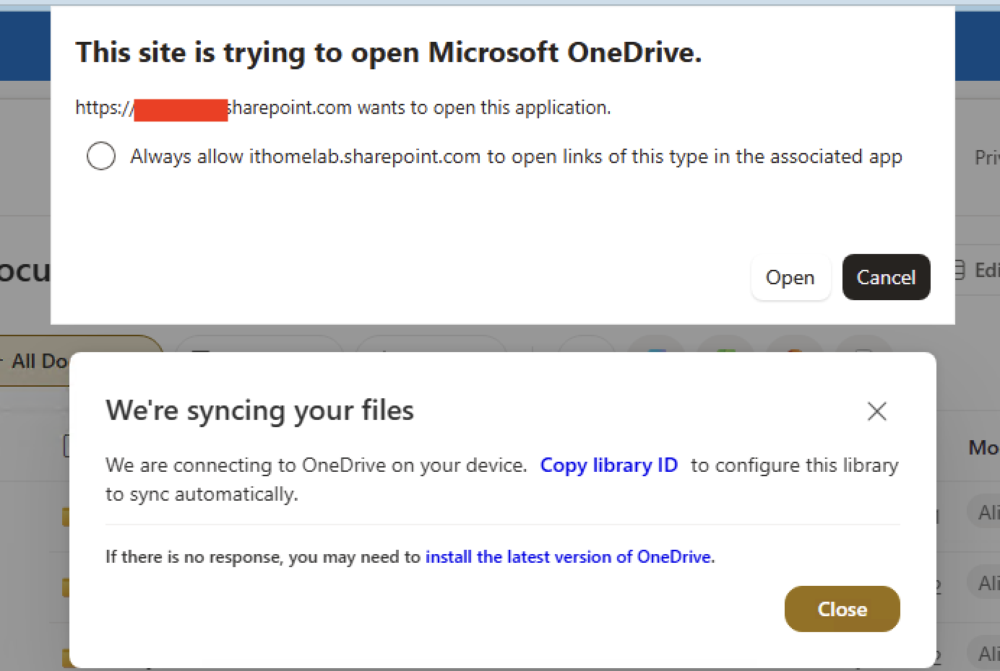 |

---

### 10. Accessing SharePoint Files from Windows Explorer

After synchronization was completed, the SharePoint library became available through Windows File Explorer under `OneDrive → IT HomeLab → IT - Documents → Documentation`.

The cloud icons show that the files are available online and can be downloaded when needed. This provides a familiar file management experience for Windows users while the files remain stored in SharePoint.

| SharePoint OneDrive Sync Success |
|:--------------------------------:|
| 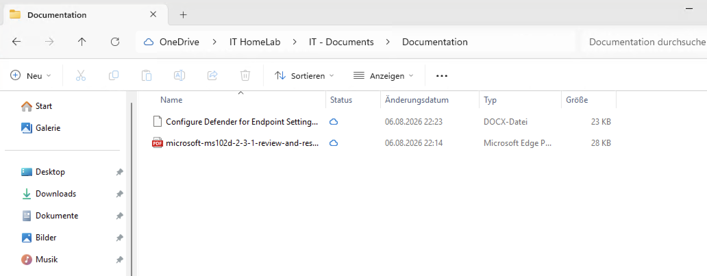 |

---

## Lessons Learned

This phase helped me understand how SharePoint and OneDrive can be used as cloud file services in a company environment.

### Key points
- SharePoint Team Sites provide a central collaboration area for departments.
- Document Libraries can be organized using folders and versioning.
- Group-based permissions are easier to manage than assigning access to individual users.
- Unique folder permissions should only be used when different access is really required.
- Direct file sharing can be useful for specific situations, but should be controlled carefully.
- The **Check Permissions** feature helps administrators understand effective user access.
- OneDrive can synchronize SharePoint libraries and make them available through Windows File Explorer.
- **Files On-Demand** helps reduce local storage usage.

---

## Result

The Cloud File Services phase was completed by building a small SharePoint environment and testing common file management and access scenarios.

---

## Navigation

| Previous | Home | Next |
|:--------:|:----:|:----:|
| ⬅️ [Phase 16 – Microsoft Entra ID Connect Cloud Sync](docs/16-Microsoft-Entra-ID-Connect-Cloud-Sync/READEME.md) | 🏠 [Home](../../README.md) | ➡️ Phase 19: Phase 17: Endpoint Management (Intune) *(Coming Soon)* |
