# Phase 19 – Microsoft Entra Connect & Hybrid Device Synchronization

> **Status:** ✅ Completed

---

## Overview

Before this phase, I set up Microsoft Entra Cloud Sync to synchronize my users and groups from my local Active Directory.

Now, I wanted to connect my Windows computers to Microsoft Entra ID as well. For this, I needed Microsoft Entra Connect Sync.

I decided to use both tools for different purposes:

- **Cloud Sync:** Users and Groups
- **Microsoft Entra Connect Sync:** Workstations and Hybrid Join

This phase explains how I installed Microsoft Entra Connect and configured Hybrid Microsoft Entra Join.

---

## 1. Why did I need Microsoft Entra Connect?

Cloud Sync was already working well for my users and groups. However, I also wanted my Windows computers to use **Hybrid Microsoft Entra Join**.

For the Hybrid Join setup I wanted to build, Cloud Sync was not enough. I therefore added Microsoft Entra Connect Sync to the lab.

I kept Cloud Sync for users and groups and used Entra Connect for my workstation devices.

This made the setup easier to manage and helped me keep the synchronization scopes separate.

---

## 2. Existing Environment

My Active Directory structure looks like this:

- **homelab.local**
  - Users
  - Groups
  - Servers
  - Computers
  - **Workstations**
    - WIN11-CL01
    - WIN11-CL02

My goal was to add device synchronization without changing my existing Cloud Sync setup.

---

## 3. My Synchronization Design

I decided to use the two synchronization tools like this:

- **Active Directory (`homelab.local`)**
  - **Cloud Sync**
    - Users
    - Groups
  - **Microsoft Entra Connect Sync**
    - Workstations
      - WIN11-CL01
      - WIN11-CL02

This keeps the two synchronization scopes separate and avoids unnecessary overlap.

---

## 4. Downloading Microsoft Entra Connect

I downloaded the Microsoft Entra Connect Sync installer from the Microsoft Entra admin center.

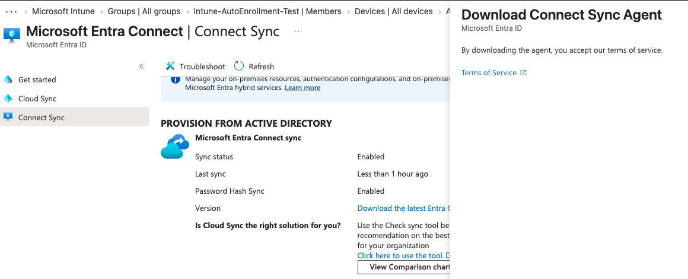

---

## 5. Express Settings vs Custom Installation

Microsoft Entra Connect provides Express Settings for a simple setup.

My lab needed some additional configuration, including:

- OU filtering
- Hybrid Microsoft Entra Join
- Service Connection Point (SCP)

Because of this, I selected **Customize**.

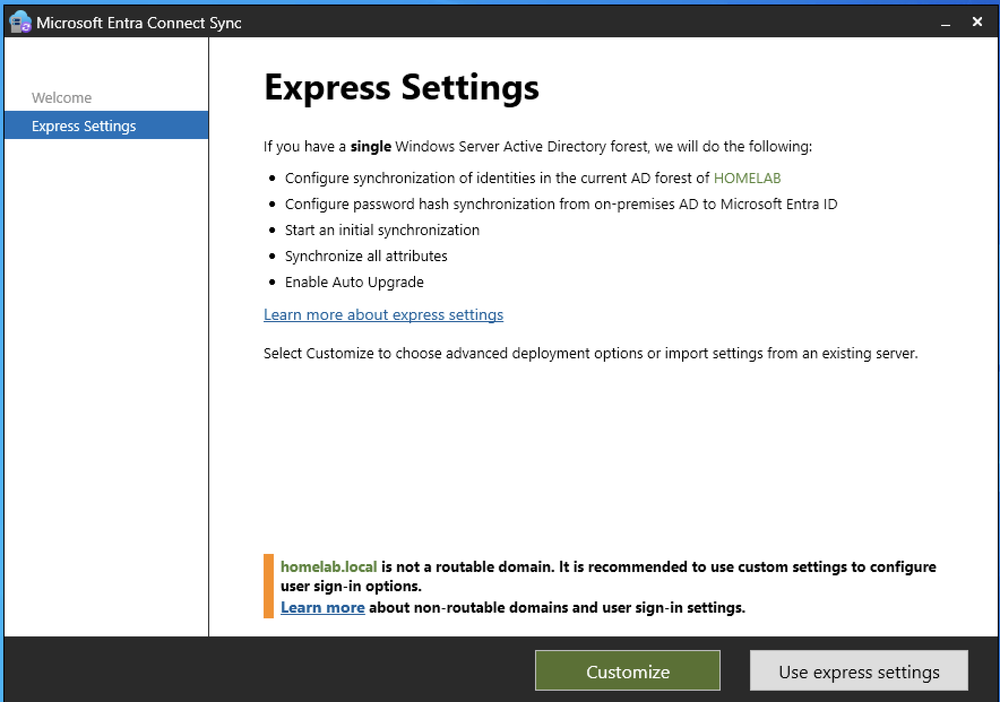

The installer also warned me that `homelab.local` is not a public internet domain.

This is expected because `homelab.local` is only used inside my HomeLab.

---

## 6. Required Components

The installer checked my server and installed the required components.

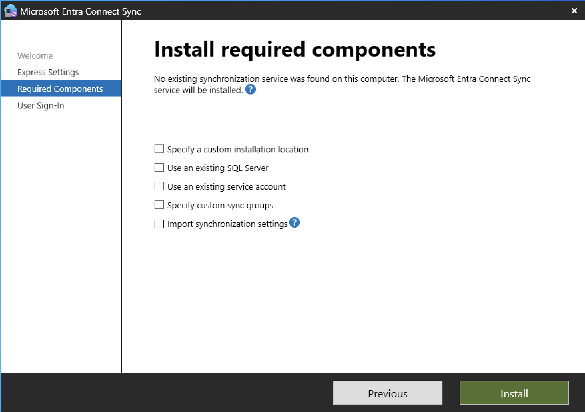

I used the default database and installation location because they are enough for this HomeLab.

---

## 7. User Sign-in

For the sign-in method, I selected **Do not configure**.

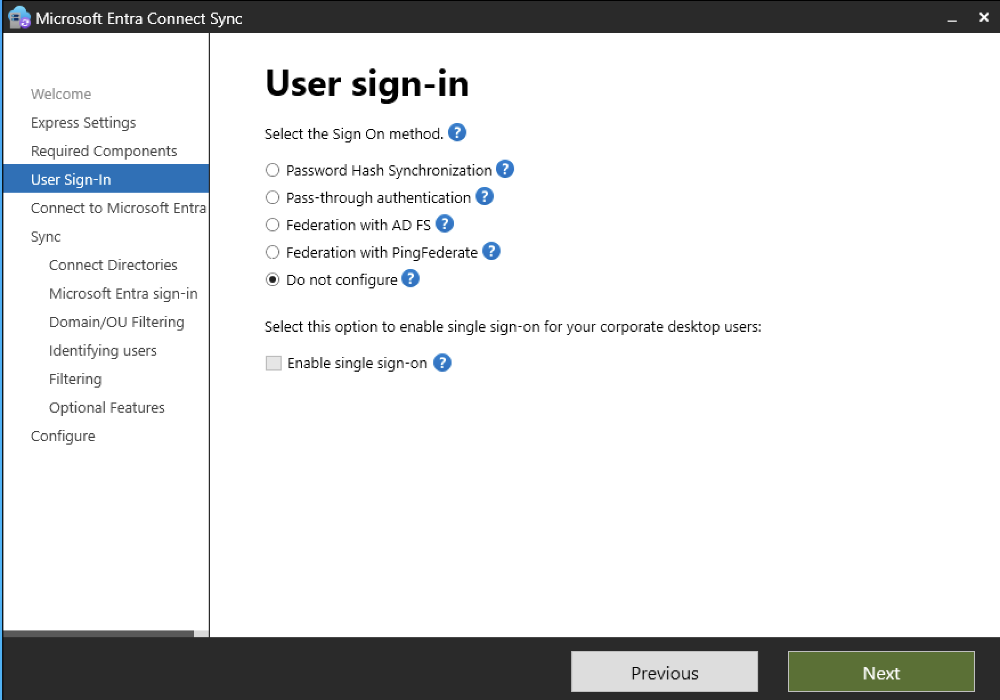

I did not need another user sign-in configuration for this setup.

---

## 8. Connecting Active Directory

I added my local Active Directory forest:

`homelab.local`

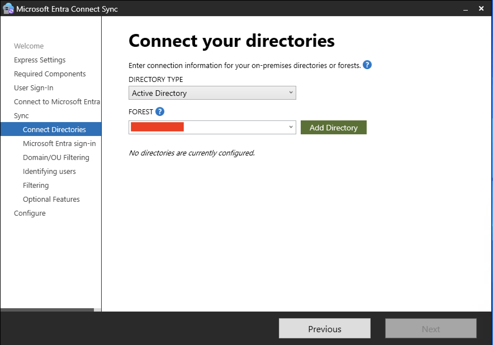

The connection was successful.

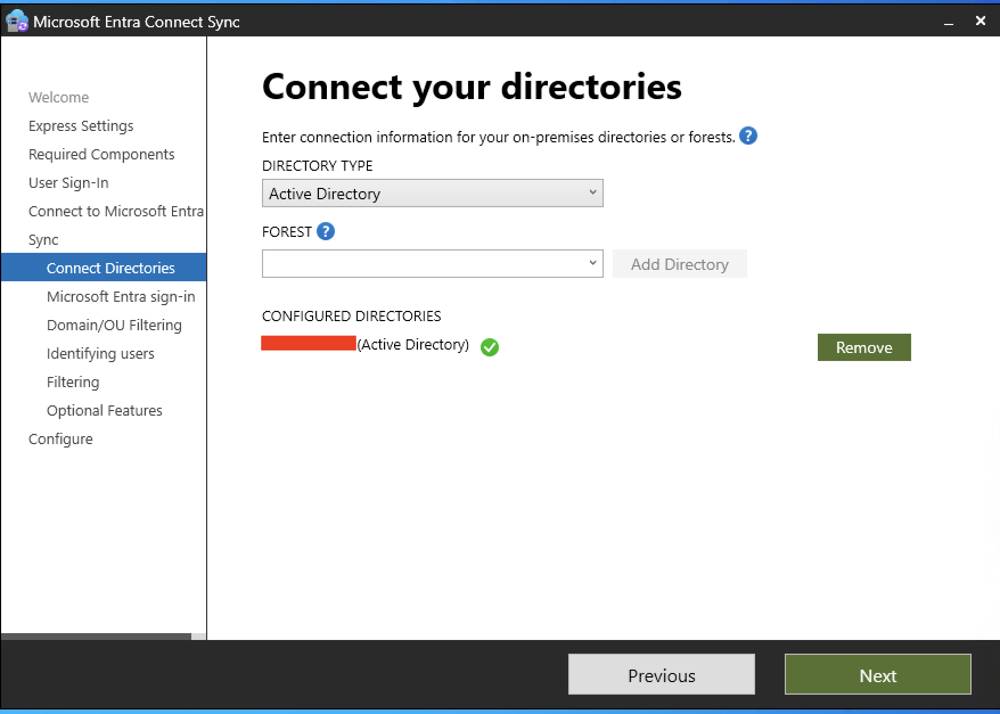

---

## 9. AD Forest Account

Microsoft Entra Connect needs an account with the required permissions to access Active Directory.

I let the wizard create the required account automatically and provided my Enterprise Admin credentials.

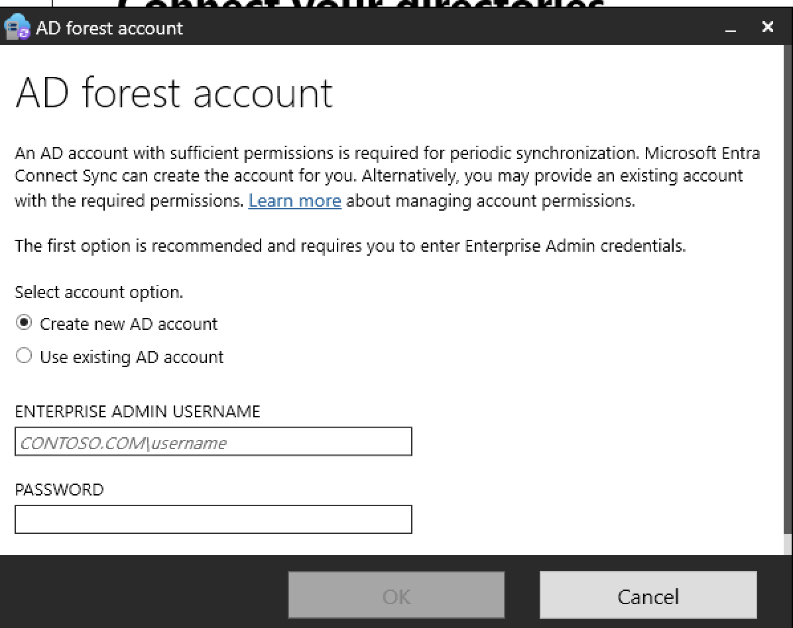

For this HomeLab, I used the existing administrator account to keep the setup simple.

---

## 10. Non-Routable Domain

My local Active Directory domain is:

`homelab.local`

My Microsoft Entra tenant uses:

`xxxxxxxx.onmicrosoft.com`

These names are used for different purposes:

- `homelab.local` → Local Active Directory
- `xxxxxxxxx.onmicrosoft.com` → Microsoft Entra ID tenant

I kept `homelab.local` because it is already used by my HomeLab. I did not change the existing domain structure.

---

## 11. User Principal Name (UPN)

Microsoft Entra Connect also showed the User Principal Name (UPN) configuration.

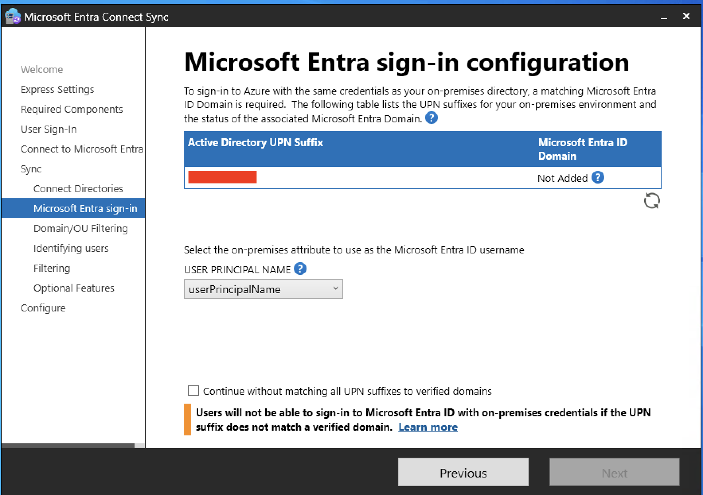

My local users use the `@homelab.local` suffix.

I did not change the existing UPNs because the main purpose of this Connect Sync setup was to synchronize my workstation devices.

---

## 12. OU Filtering

I did not want to synchronize everything from Active Directory.

I selected only the `Workstations` OU.

- **homelab.local**
  - Users *(Not selected)*
  - Groups *(Not selected)*
  - Servers *(Not selected)*
  - Computers *(Not selected)*
  - **Workstations *(Selected)***
    - WIN11-CL01
    - WIN11-CL02

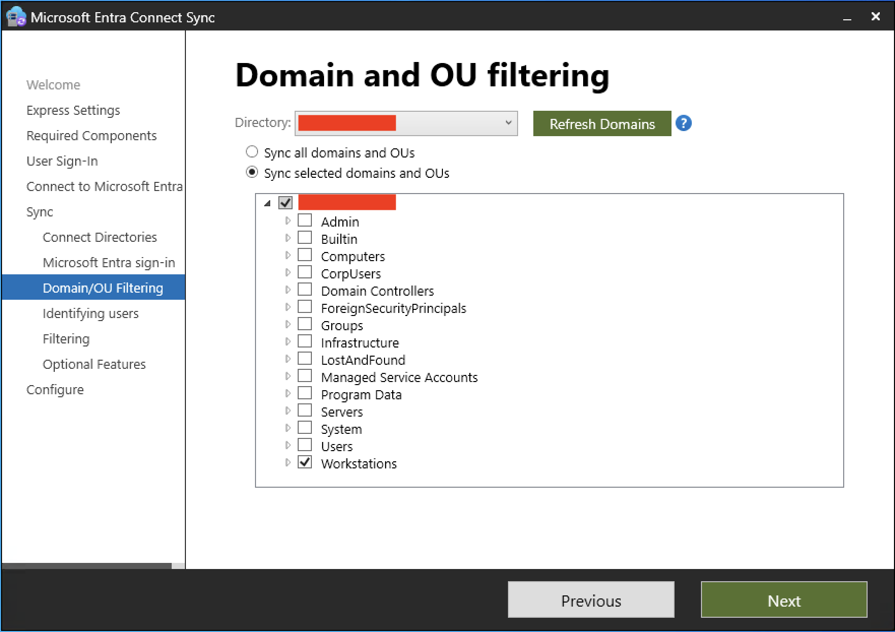

This keeps the synchronization scope small and makes the setup easier to manage.

---

## 13. User Identification

I kept the default options here.

**Users are represented only once across all directories**

and:

**Let Azure manage the source anchor**

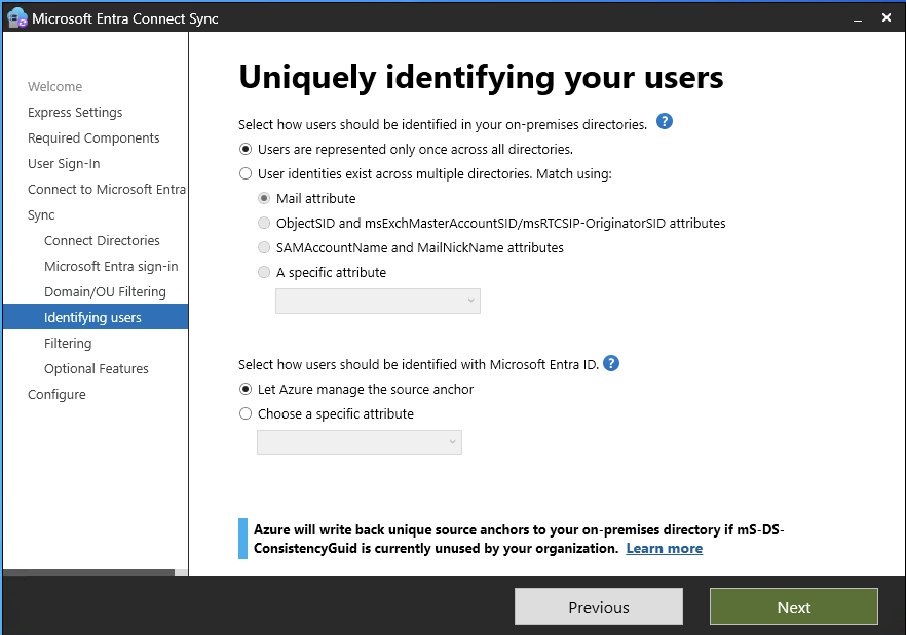

I did not need to create a custom source anchor for this HomeLab.

---

## 14. Filtering

I kept the synchronization limited to the devices in the selected OU.

- **Active Directory**
  - **Workstations**
    - WIN11-CL01
    - WIN11-CL02

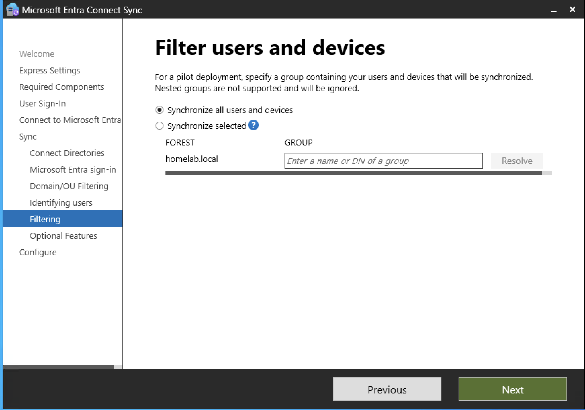

This keeps the Cloud Sync and Connect Sync scopes separate.

---

## 15. Optional Features

I did not select additional features such as:

- Password Writeback
- Exchange Hybrid
- Group Writeback
- Device Writeback

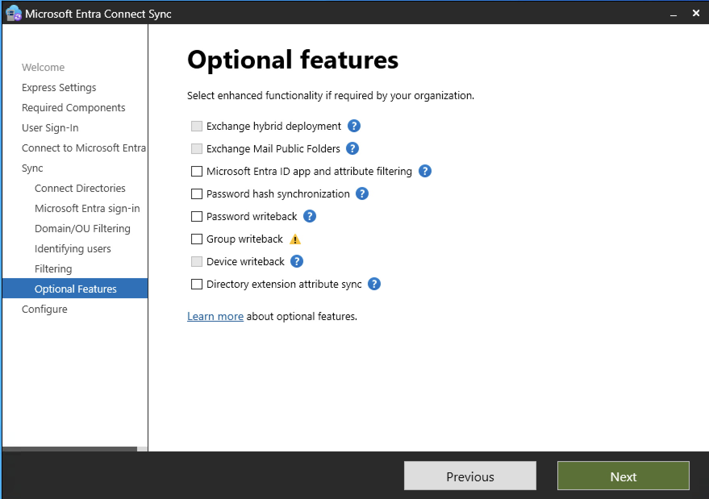

I kept the configuration focused on what I needed for this phase.

---

## 16. Hybrid Microsoft Entra Join

After configuring the directory synchronization, I selected **Configure Hybrid Microsoft Entra ID Join**.

My goal was simple:

- Windows 11 client
  - Joined to the local domain: `homelab.local`
  - Hybrid Joined to Microsoft Entra ID

---

## 17. Service Connection Point (SCP)

I configured the Service Connection Point (SCP).

The SCP is like a signpost. It tells my domain-joined Windows computers which Microsoft Entra tenant they should use.

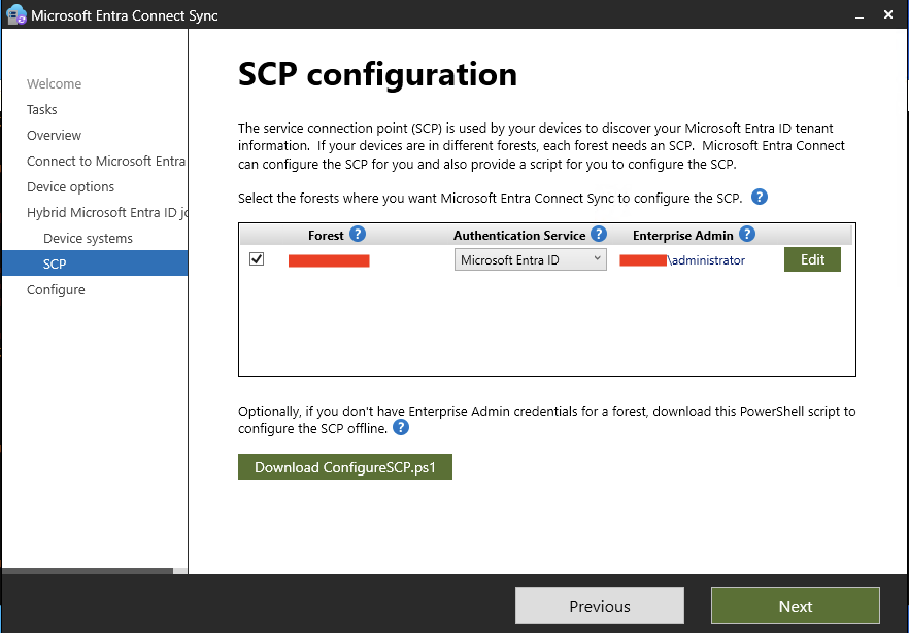

I authenticated with my administrator account and configured the SCP for my `homelab.local` forest.

---

## 18. Synchronization

After completing the installation, Microsoft Entra Connect started the synchronization process.

I also checked the synchronization service and scheduler to make sure they were running correctly.

The workstation objects were then synchronized based on the selected `Workstations` OU.

---

## 19. Hybrid Microsoft Entra Join Test

I went to my Windows 11 client, `WIN11-CL02`, to test the configuration.

I opened Command Prompt and ran:

```cmd
dsregcmd /status
```

At first, the result showed:

```text
AzureAdJoined : NO
DomainJoined  : YES
```

This meant that the computer was correctly joined to the local Active Directory domain, but Hybrid Microsoft Entra Join had not completed yet.

---

## 20. Troubleshooting

The first Hybrid Join attempt did not work as expected.

I checked several parts of the environment:

* Active Directory DNS
* Client DNS settings
* Router DNS
* IPv6 configuration
* OU filtering
* Microsoft Entra Connect synchronization
* SCP configuration

I found that the DNS and network configuration needed some adjustments.

After correcting the configuration and running the synchronization again, I tested the device again.

---

## 21. Final Result

The device successfully registered in Microsoft Entra ID.

The Microsoft Entra admin center showed:

**WIN11-CL02 – Microsoft Entra hybrid joined**

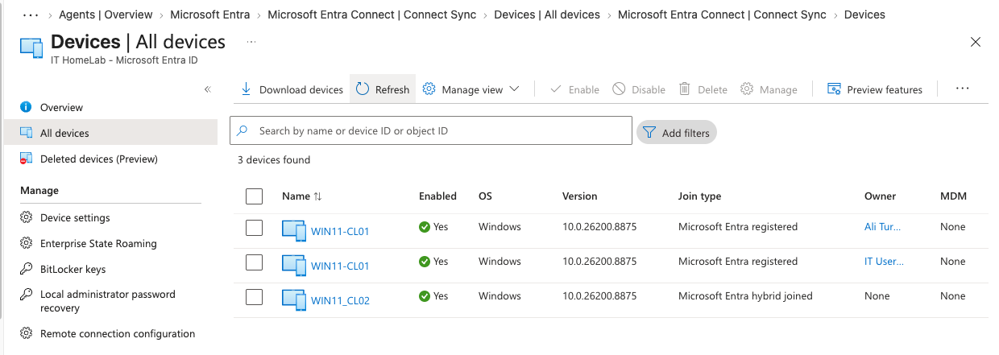

I also ran:

```cmd
dsregcmd /status
```

again on the Windows client. This time the result showed:

```text
AzureAdJoined : YES
DomainJoined  : YES
```

The final state of `WIN11-CL02` was:

* **Domain Joined:** `homelab.local`
* **Microsoft Entra Hybrid Joined:** Microsoft Entra ID

The Hybrid Microsoft Entra Join setup is now working.

---

## 22. Lessons Learned

* **Two Sync Tools:** Cloud Sync and Entra Connect can be used together when they have different synchronization scopes.
* **OU Filtering:** I did not need to synchronize the whole Active Directory. I only selected the `Workstations` OU.
* **SCP:** The Service Connection Point helps domain-joined computers find the Microsoft Entra tenant.
* **DNS:** DNS is an important part of the Hybrid Join process. Incorrect DNS or IPv6 settings can prevent the device from registering correctly.
* **Troubleshooting:** `dsregcmd /status` was very useful for checking the device registration state and finding problems.

---

## 23. Conclusion

In this phase, I added Microsoft Entra Connect Sync to my existing HomeLab.

My final setup is:

* **Cloud Sync** → Users and Groups
* **Microsoft Entra Connect Sync** → Workstations
* **WIN11-CL02** → Domain Joined + Microsoft Entra Hybrid Joined

The device is now ready for the next part of the project.

In **Phase 20**, I will start working with **Microsoft Intune** and use the connected Windows devices for endpoint management.

---

## Navigation

| Previous                                                                    | Home                           | Next                                              |
| --------------------------------------------------------------------------- | ------------------------------ | ------------------------------------------------- |
| ⬅️ [**Phase 18: Cloud File Services**](../18–Cloud-File-Services/README.md) | 🏠 [**Home**](../../README.md) | ➡️ [**Phase 20: Microsoft Intune & Endpoint Management**](../20–Microsoft-Intune-Endpoint-Management/README.md) |
