# Phase 20 – Microsoft Intune & Endpoint Management

> **Status:** ✅ Completed  
> **Focus:** Microsoft Intune, Windows 11 automatic enrollment, device management, compliance, and Conditional Access

---

## 1. Overview

In this phase, I implemented Microsoft Intune for Windows 11 endpoint management in the HomeLab environment.

The main goal was to understand how a Windows device can move from a traditional on-premises Active Directory environment to a modern cloud-based endpoint management model.

The complete flow used in this phase is:

```text
Windows 11 Client
       ↓
Active Directory
       ↓
Microsoft Entra ID
       ↓
Hybrid Join
       ↓
Microsoft Intune
       ↓
Configuration
       ↓
Compliance
       ↓
Conditional Access
```

The main topics covered in this phase are:

- Microsoft Intune fundamentals
- Windows 11 automatic MDM enrollment
- User and device targeting
- Configuration Profiles
- Compliance Policies
- Conditional Access
- Hybrid endpoint management
- Troubleshooting

---

## 2. Environment

The HomeLab already had a hybrid identity environment from the previous phases.

The main test device for the final Intune validation was **WIN11-CL01**.

The second Windows client, WIN11-CL02 was not included in the final Intune validation because it was not successfully enrolled into Intune.

| **Component** | **Purpose** |
|---|---|
| Windows Server | Active Directory Domain Services |
| Microsoft Entra ID | Cloud identity |
| Microsoft Entra Connect | Identity and device synchronization |
| Microsoft Intune | Endpoint management |
| Windows 11 | Test client - WIN11-CL01 |
| Proxmox VE | Virtualization platform |

---

## 3. Automatic Enrollment

The first step was to configure automatic enrollment for Windows devices.

The goal was to allow a user with the appropriate MDM scope to automatically enroll a Windows device into Microsoft Intune without manual setup.

### MDM User Scope

The MDM user scope was configured for automatic enrollment in the Microsoft Entra portal.

The test user was included in a dedicated security group named **Intune-AutoEnrollment-Test**.

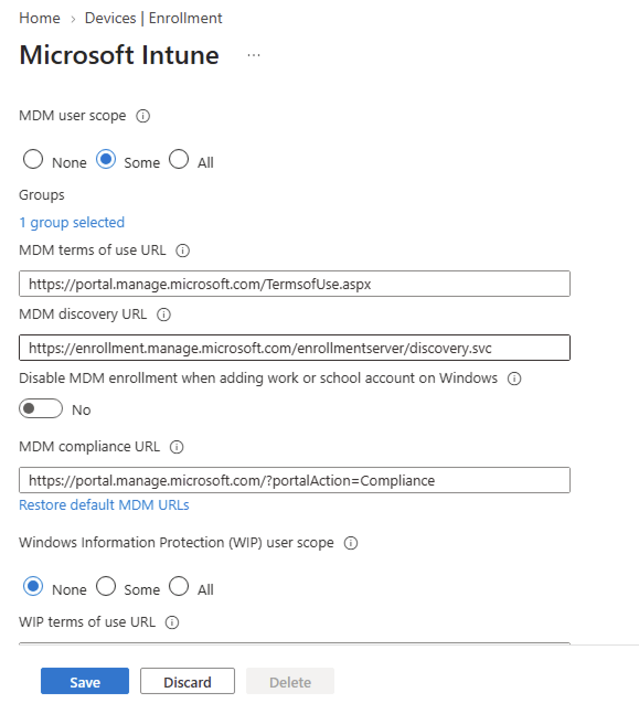

The test user was added to the enrollment group.

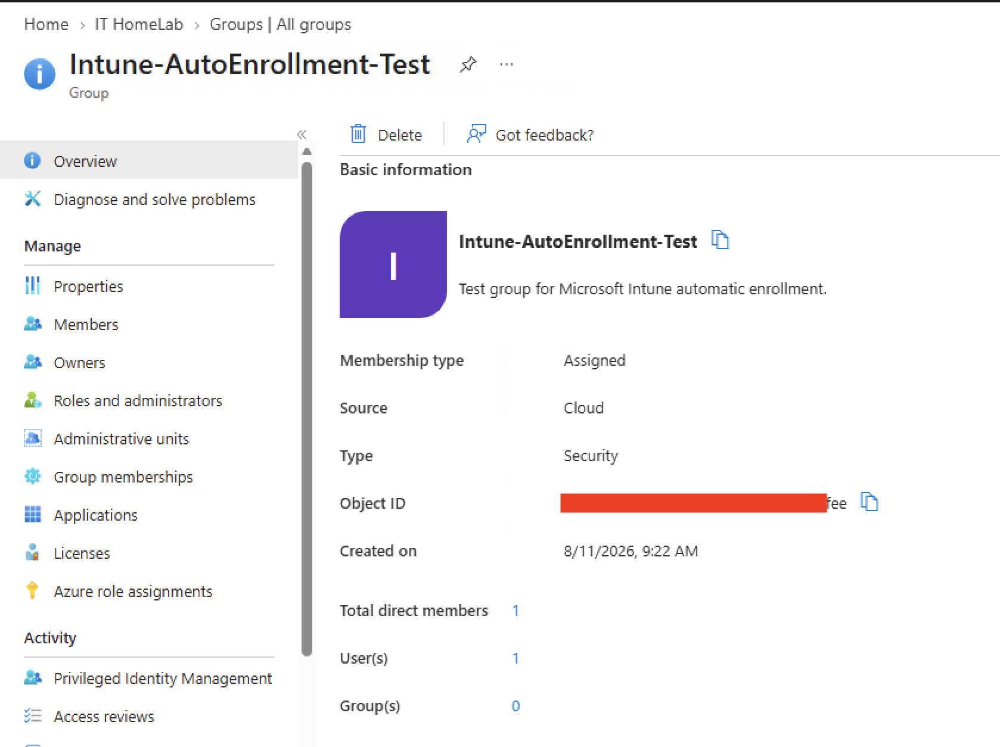

This allowed the selected test user to be included in the automatic MDM enrollment scope.

### Automatic Enrollment through Group Policy

Because the Windows client is also joined to the on-premises Active Directory domain, Group Policy (GPO) was used to configure automatic MDM enrollment.

The required MDM enrollment setting was enabled in the GPO.

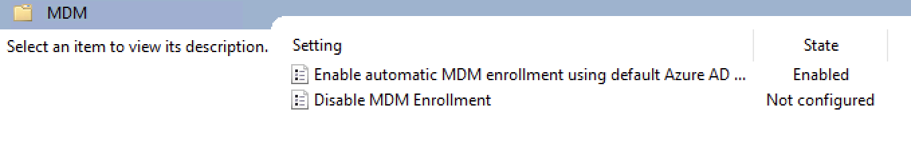

The GPO was linked to the appropriate Workstations OU.


After the required settings were applied, the enrollment process was tested on **WIN11-CL01**.

The device did not enroll successfully at first. The initial tests were performed through an RDP session, which led to several troubleshooting steps.

The enrollment was later tested through the **Proxmox VE Console**. After switching from RDP to the local console session, the enrollment completed successfully and the device appeared in Microsoft Intune.

The troubleshooting details are described in the [Troubleshooting](#9-troubleshooting) section.

---

## 4. Configuration Profiles

After enrollment, the next step was to configure the Windows device.

Configuration Profiles allow administrators to centrally configure Windows settings through Microsoft Intune.

For the HomeLab, a basic **Windows Firewall** configuration profile was created.

The required firewall settings were configured and the profile was assigned to the test device group.

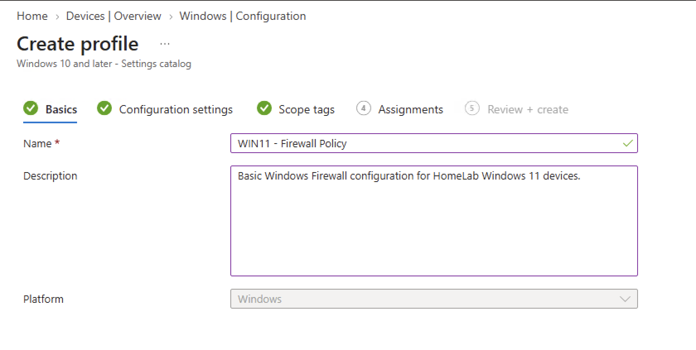

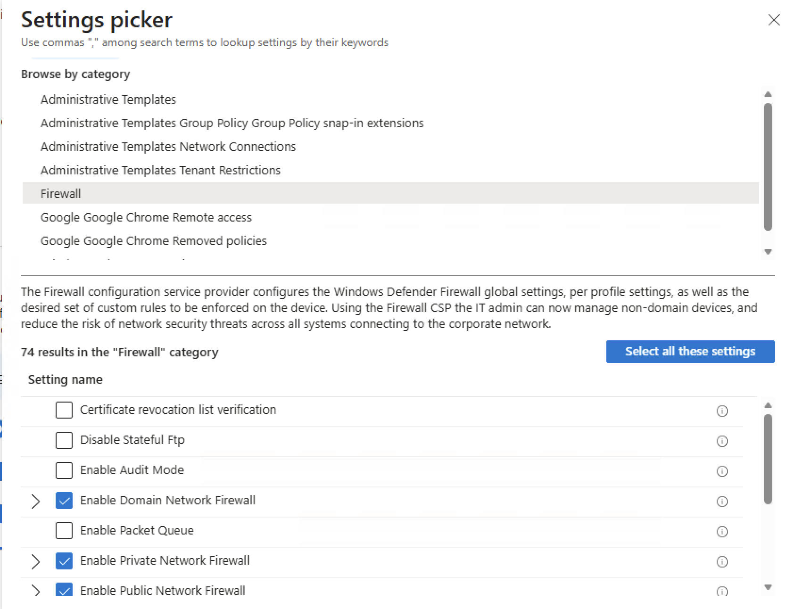

This demonstrated the basic Intune configuration workflow:

```text
Create Profile
      ↓
Configure Settings
      ↓
Assign Group
      ↓
Review
      ↓
Deploy
```

---

## 5. Compliance Policy

Configuration Profiles define **how** a device should be configured.

Compliance Policies are different. They check **whether** a device meets the required security conditions.

For this HomeLab, a Windows 10/11 Compliance Policy was created to check several security requirements, including:

- Minimum OS version
- Windows Firewall
- Antivirus
- Antispyware
- Microsoft Defender
- Real-time protection
- Trusted Platform Module (TPM)

### Compliance Policy Basics

The main compliance requirements were configured in the policy.

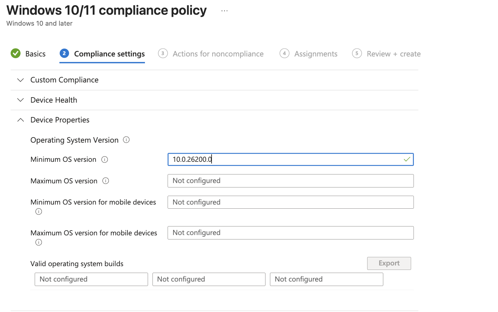

The device security requirements were then configured.

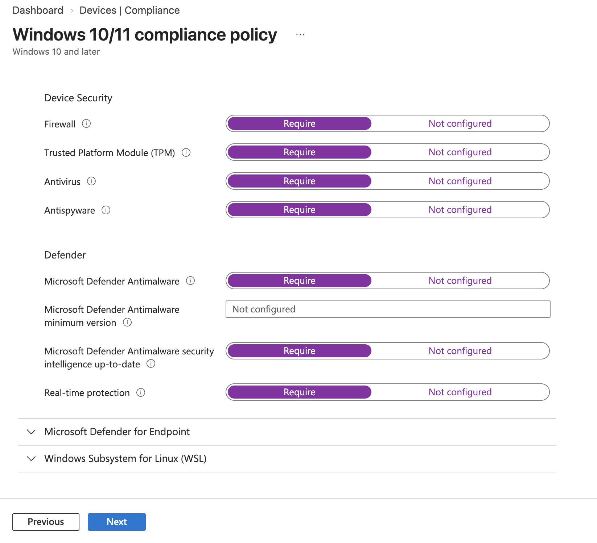

### Noncompliance Actions

A noncompliance action was configured so that devices are marked as noncompliant when they fail the required security checks.

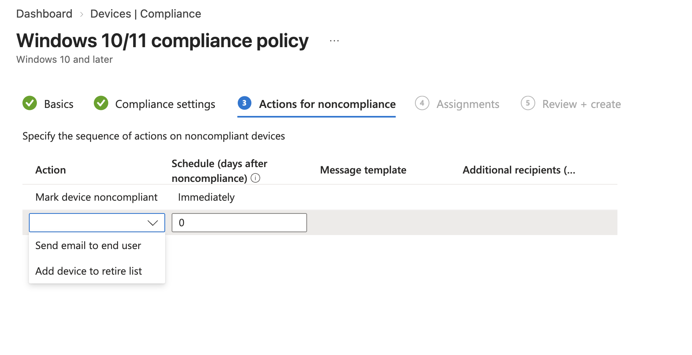

The policy was assigned to the dedicated test device group.

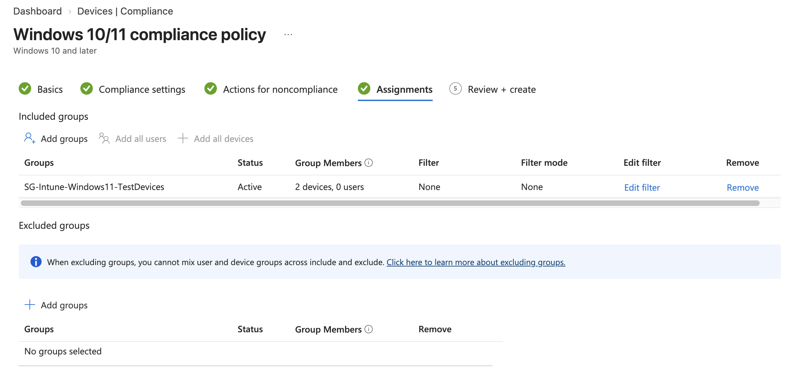

---

## 6. Compliance Validation

After the policy was assigned, Intune evaluated **WIN11-CL01**.

The device was successfully reported as **Compliant**.

The per-setting status showed that the configured security requirements were successfully evaluated and passed.

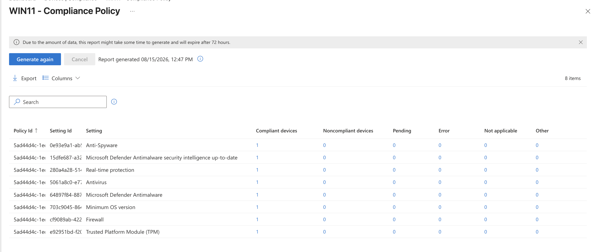

The compliance evaluation included settings such as:

- Antivirus
- Antispyware
- Microsoft Defender
- Real-time protection
- Windows Firewall
- Minimum OS version
- Trusted Platform Module (TPM)

This confirmed that the compliance policy was not only created but was actively evaluating the Windows 11 device.

---

## 7. Conditional Access

The next step was to connect Intune compliance with Microsoft Entra ID Conditional Access.

The goal was to require a compliant device before allowing a user to access cloud resources.

The basic security flow is:

```text
User
 ↓
Microsoft Entra ID
 ↓
Conditional Access
 ↓
Is the device compliant?
 ↓
Yes → Allow access
No  → Block access
```

A Conditional Access policy named **CA - Require Compliant Device - Test** was created.

### Report-Only Mode

The policy was initially configured in **Report-only** mode.

This allowed the policy behavior to be checked in the sign-in logs without immediately blocking the user.

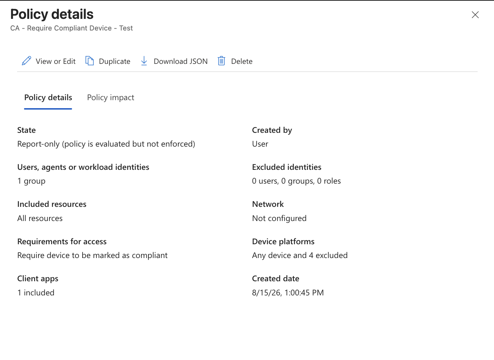

The sign-in logs were then used to verify that the policy was evaluated.

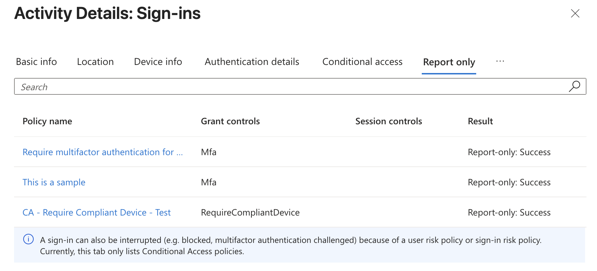

The Report-only test showed that the Conditional Access policy was evaluated successfully for the test user.

### Conditional Access Validation

After confirming that the policy was evaluated correctly, the policy was changed from **Report-only** to **On**.

A new sign-in was performed using the test user.

The sign-in logs showed that the Conditional Access policy was evaluated successfully. Because Intune reported the device as compliant, the required compliance condition was satisfied and the sign-in was successful.

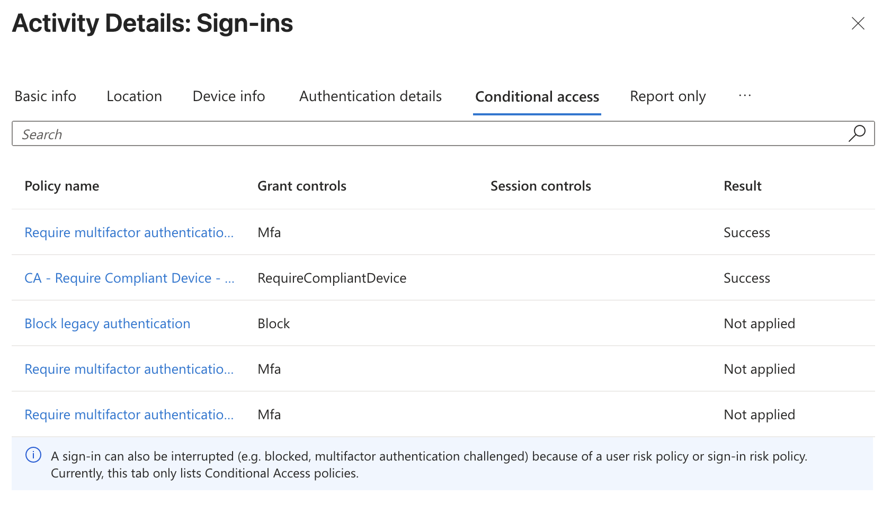

---

## 8. Device and User Targeting

One important topic during this phase was the difference between **user-based** and **device-based** targeting.

Intune policies can be assigned to:

- Users
- User groups
- Devices
- Device groups

For example, automatic enrollment was configured around the user and MDM scope, while the compliance policy was assigned to a dedicated device group.

A policy assigned to a user is not always equivalent to a policy assigned directly to a device.

The assignment target should therefore be selected based on the purpose of the policy.

---

## 9. Troubleshooting

### 9.1 Automatic Intune Enrollment through RDP

One of the most important troubleshooting findings in this phase was related to the Windows session type.

During the automatic Intune enrollment tests, the Windows device was initially accessed through a Remote Desktop (RDP) session.

At that time, the `dsregcmd /status` command showed:

```text
SessionIsNotRemote : No
```

This confirmed that Windows was running in a remote session.

The same enrollment process was later tested through the **Proxmox VE Console**.

After switching to the local console session, `SessionIsNotRemote` changed to:

```text
SessionIsNotRemote : Yes
```

The enrollment process then completed successfully, and WIN11-CL01 appeared in Microsoft Intune as a managed and compliant device.

The troubleshooting path was:

```text
Windows 11
     ↓
RDP Session
     ↓
SessionIsNotRemote: No
     ↓
Enrollment did not complete
     ↓
Proxmox VE Console
     ↓
SessionIsNotRemote: Yes
     ↓
Intune Enrollment Successful
```

### Lesson Learned

In this HomeLab, the type of Windows session was an important factor during automatic MDM enrollment troubleshooting.

The Proxmox VE Console provided a local interactive session, and the enrollment process completed successfully after switching from RDP to the local console.

This was an important troubleshooting finding for this virtualized HomeLab environment.

## 10. Compliance Policy Troubleshooting

During the configuration process, the Compliance Policy was accidentally created twice with the same settings and assignment.

The duplicate policy was removed to keep the Intune configuration clean.

This was a useful reminder to check existing policies before creating new ones.

A clean policy structure is important because duplicate or overlapping policies can make troubleshooting more difficult.

---

## 11. Device Health Settings

Some advanced device health requirements were intentionally left unconfigured in this HomeLab.

For example:

- BitLocker
- Secure Boot
- Code Integrity

These settings were not required for the initial compliance test.

The main goal was to first validate the basic endpoint management workflow.

More advanced security requirements can be added later as the HomeLab develops.

---

## 12. Lessons Learned

### RDP vs. Local Console

The session type can affect automatic MDM enrollment troubleshooting in a virtualized HomeLab environment.

### User and Device Targeting

Another important lesson was that user targeting and device targeting serve different purposes.

Automatic enrollment was configured around the user and MDM scope, while the compliance policy was assigned to a dedicated device group.

Understanding the difference helps avoid assigning a policy to the wrong object.

### User Identity in Hybrid Environments

Hybrid environments can contain identities from different systems.

For example:

```text
IT User01
 ├── On-premises Active Directory account
 └── Microsoft Entra ID account
```

This can sometimes cause confusion when assigning licenses, permissions, or policies.

Before making changes, it is important to verify:

- User Principal Name (UPN)
- Email address
- Group membership
- Object identity
- Account source
- Assigned licenses

This is especially important when similar user names exist in both on-premises Active Directory and Microsoft Entra ID.

### Start Simple and Add Security Gradually

The HomeLab started with a limited set of security requirements.

More advanced requirements can be added later as the environment develops.

Starting with a smaller set of requirements makes troubleshooting easier because each part of the endpoint management process can be tested separately.

### User Synchronization vs. Device Synchronization

A key lesson from the hybrid identity implementation was that user and device synchronization are different requirements. Cloud Sync was initially used for users and groups, while Microsoft Entra Connect Sync was introduced for the required device synchronization scenario. Keeping these responsibilities separate provided a clearer hybrid identity architecture.

---

## 13. Hybrid Join Validation

Before the final Intune and Conditional Access validation, the hybrid device state of **WIN11-CL01** was also checked.

The `dsregcmd /status` command confirmed that the device was joined to both the on-premises Active Directory domain and Microsoft Entra ID.

The important values were:

```text
AzureAdJoined    : YES
DomainJoined     : YES
DeviceAuthStatus : SUCCESS
```

The device was also visible in Microsoft Entra ID as a **Microsoft Entra hybrid joined** device.

This confirmed that WIN11-CL01 was successfully connected to the on-premises Active Directory and Microsoft Entra ID environment and was managed by Microsoft Intune.

---

## 14. Final Result

At the end of this phase, the HomeLab had a working endpoint management workflow for **WIN11-CL01**.

The final architecture is:

```text
AD Domain
   ↓
Entra ID
   ↓
WIN11-CL01
   ↓
Intune Enrollment
   ↓
Firewall Configuration
   ↓
Compliance Check
   ↓
Compliant Device
   ↓
Conditional Access
   ↓
Microsoft 365 Access
```

---

## 15. Summary

This phase demonstrated how Microsoft Intune can be integrated into a hybrid Windows environment.

The HomeLab now demonstrates:

- Windows 11 automatic enrollment
- Group Policy-based MDM enrollment
- Microsoft Intune device management
- Configuration Profiles
- Compliance Policies
- Device group assignment
- Compliance validation
- Microsoft Entra Conditional Access
- Hybrid identity integration
- Endpoint management troubleshooting

The most important result was not simply that **WIN11-CL01 became compliant**.

The important result was understanding how the different Microsoft technologies work together.

---

## Navigation

| **Previous** | **Home** | **Next** |
|---|---|---|
| ⬅️ [**Phase 19: Entra Connect & Hybrid Device Sync**](../19–Entra-Connect-Hybrid-Device-Sync/README.md) | 🏠 [**Home**](../../README.md) | ➡️ Enterprise Linux & Containers Lab *(Coming Soon)* |
